Project 2: Factors that may affect graduate admission
================
Huiqian Wang hw8849
4/14/2021

## Introduction

Since I am going to apply for a graduate school this year, I wonder what
factors may affect the admission rate and their relationship. I found
this ‘Graduate Amission’ dataset on Kaggle platform. The dataset is
owned by Mohan S Acharya. It contains several parameters which are
considered important during the application for Masters Programs:

1.  GRE Scores ( out of 340 )
2.  TOEFL Scores ( out of 120 )
3.  University Rating ( out of 5 )
4.  Statement of Purpose(SOP) ( out of 5)
5.  Letter of Recommendation Strength(LOR) ( out of 5 )
6.  Undergraduate GPA ( out of 10 )
7.  Research Experience ( either 0 or 1 )
8.  Chance of Admit ( ranging from 0 to 1 )

There are 500 observations and 8 variables (excluding the first column
which is just a counting of No.).

Note that the data is from Indian perspective and also it was sampled
for engineering students specifically.

``` r
# Reading dataset and importing package
library(readr)
library(dplyr)
```

    ## 
    ## Attaching package: 'dplyr'

    ## The following objects are masked from 'package:stats':
    ## 
    ##     filter, lag

    ## The following objects are masked from 'package:base':
    ## 
    ##     intersect, setdiff, setequal, union

``` r
library(ggplot2)
library(tidyverse)
```

    ## ── Attaching packages ───────────────────────────────────────────────────── tidyverse 1.3.0 ──

    ## ✓ tibble  3.0.5     ✓ stringr 1.4.0
    ## ✓ tidyr   1.1.2     ✓ forcats 0.4.0
    ## ✓ purrr   0.3.3

    ## ── Conflicts ──────────────────────────────────────────────────────── tidyverse_conflicts() ──
    ## x dplyr::filter() masks stats::filter()
    ## x dplyr::lag()    masks stats::lag()

``` r
admission <- read.csv("Admission_Predict_Ver1.1.csv")
head(admission)
```

    ##   Serial.No. GRE.Score TOEFL.Score University.Rating SOP LOR CGPA Research
    ## 1          1       337         118                 4 4.5 4.5 9.65        1
    ## 2          2       324         107                 4 4.0 4.5 8.87        1
    ## 3          3       316         104                 3 3.0 3.5 8.00        1
    ## 4          4       322         110                 3 3.5 2.5 8.67        1
    ## 5          5       314         103                 2 2.0 3.0 8.21        0
    ## 6          6       330         115                 5 4.5 3.0 9.34        1
    ##   Chance.of.Admit
    ## 1            0.92
    ## 2            0.76
    ## 3            0.72
    ## 4            0.80
    ## 5            0.65
    ## 6            0.90

``` r
# Checking if there is NA values
sum(is.na(admission))
```

    ## [1] 0

The data is clean enough, so I did not using any tidy method. But I may
modify the datasets in later sections.

## EDA

``` r
# Statistics
summary(admission)
```

    ##    Serial.No.      GRE.Score      TOEFL.Score    University.Rating
    ##  Min.   :  1.0   Min.   :290.0   Min.   : 92.0   Min.   :1.000    
    ##  1st Qu.:125.8   1st Qu.:308.0   1st Qu.:103.0   1st Qu.:2.000    
    ##  Median :250.5   Median :317.0   Median :107.0   Median :3.000    
    ##  Mean   :250.5   Mean   :316.5   Mean   :107.2   Mean   :3.114    
    ##  3rd Qu.:375.2   3rd Qu.:325.0   3rd Qu.:112.0   3rd Qu.:4.000    
    ##  Max.   :500.0   Max.   :340.0   Max.   :120.0   Max.   :5.000    
    ##       SOP             LOR             CGPA          Research   
    ##  Min.   :1.000   Min.   :1.000   Min.   :6.800   Min.   :0.00  
    ##  1st Qu.:2.500   1st Qu.:3.000   1st Qu.:8.127   1st Qu.:0.00  
    ##  Median :3.500   Median :3.500   Median :8.560   Median :1.00  
    ##  Mean   :3.374   Mean   :3.484   Mean   :8.576   Mean   :0.56  
    ##  3rd Qu.:4.000   3rd Qu.:4.000   3rd Qu.:9.040   3rd Qu.:1.00  
    ##  Max.   :5.000   Max.   :5.000   Max.   :9.920   Max.   :1.00  
    ##  Chance.of.Admit 
    ##  Min.   :0.3400  
    ##  1st Qu.:0.6300  
    ##  Median :0.7200  
    ##  Mean   :0.7217  
    ##  3rd Qu.:0.8200  
    ##  Max.   :0.9700

We can see that the mean GRE is 316.5, CGPA is 8.576. Chance of admit
range from 0.34 to 0.97.

``` r
# Choosing only numeric variables except the first column(the obs No.)
adm_num <-admission %>%
  select_if(is.numeric) %>%
  select(-1)

# Make a correlation matrix
cor(adm_num, use = "pairwise.complete.obs") %>%
  # Save as a data frame
  as.data.frame %>%
  # Convert row names to an explicit variable
  rownames_to_column %>%
  # Pivot so that all correlations appear in the same column
  pivot_longer(-1, names_to = "other_var", values_to = "correlation") %>%
  ggplot(aes(rowname, other_var, fill=correlation)) +
  # Heatmap with geom_tile
  geom_tile() +
  # Change the scale to make the middle appear neutral
  scale_fill_gradient2(low="green",mid="white",high="red") +
  # Overlay values
  geom_text(aes(label = round(correlation,2)), color = "black", size = 4) +
  # Give title and labels
  labs(title = "Correlation matrix for the dataset admission", x = "variable 1", y = "variable 2") +
  theme(axis.text.x = element_text(angle = 25, hjust = 1))
```

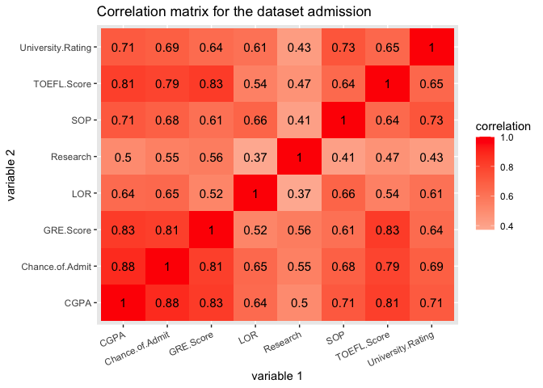<!-- -->

From the correlation matrix we can see that CGPA has the highest
correlation with chance of admit. CGPA and GRE score are also correlated
closely. GRE and TOEFLE score have a relatively high correlation too.
Research and LOR have the least correlation.

``` r
# building a correlation matrix with univariate and bivariate graphs
library(psych)
```

    ## 
    ## Attaching package: 'psych'

    ## The following objects are masked from 'package:ggplot2':
    ## 
    ##     %+%, alpha

``` r
pairs.panels(adm_num, 
             method = "pearson", # correlation coefficient method
             hist.col = "blue", # color of histogram 
             smooth = FALSE, density = FALSE, ellipses = FALSE)
```

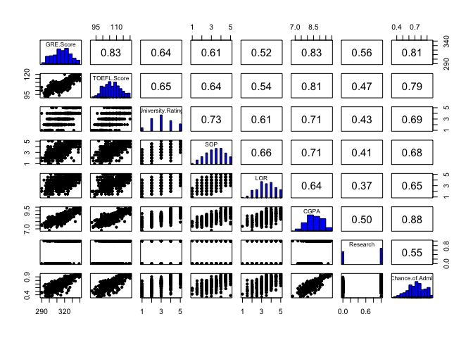<!-- -->

From the above correlation matrix with univariate and bivariate graphs
we find out that there are several catagorical variables. University
Rating, Statement of Purpose and Letter of Recommendation Strength seem
to be ordinal, research experience is categorical. And we can find that
the higher correlation, the clearer the patters are in the half right
graph. GRE, TOEFL, and CGPA tend to have a normal distribution. The
chance of admit tend to skew to the right.

``` r
# class or typr of the variables
str(admission)
```

    ## 'data.frame':    500 obs. of  9 variables:
    ##  $ Serial.No.       : int  1 2 3 4 5 6 7 8 9 10 ...
    ##  $ GRE.Score        : int  337 324 316 322 314 330 321 308 302 323 ...
    ##  $ TOEFL.Score      : int  118 107 104 110 103 115 109 101 102 108 ...
    ##  $ University.Rating: int  4 4 3 3 2 5 3 2 1 3 ...
    ##  $ SOP              : num  4.5 4 3 3.5 2 4.5 3 3 2 3.5 ...
    ##  $ LOR              : num  4.5 4.5 3.5 2.5 3 3 4 4 1.5 3 ...
    ##  $ CGPA             : num  9.65 8.87 8 8.67 8.21 9.34 8.2 7.9 8 8.6 ...
    ##  $ Research         : int  1 1 1 1 0 1 1 0 0 0 ...
    ##  $ Chance.of.Admit  : num  0.92 0.76 0.72 0.8 0.65 0.9 0.75 0.68 0.5 0.45 ...

We want to change the University.Rating, SOP, LOR, and Research
variables to factor type or catagorical.

``` r
# Change the type of numeric to factor
admission$University.Rating = as.factor(admission$University.Rating)
admission$Research = as.factor(admission$Research)
admission$SOP = as.factor(admission$SOP)
admission$LOR = as.factor(admission$LOR)
```

``` r
# Check the class again
str(admission)
```

    ## 'data.frame':    500 obs. of  9 variables:
    ##  $ Serial.No.       : int  1 2 3 4 5 6 7 8 9 10 ...
    ##  $ GRE.Score        : int  337 324 316 322 314 330 321 308 302 323 ...
    ##  $ TOEFL.Score      : int  118 107 104 110 103 115 109 101 102 108 ...
    ##  $ University.Rating: Factor w/ 5 levels "1","2","3","4",..: 4 4 3 3 2 5 3 2 1 3 ...
    ##  $ SOP              : Factor w/ 9 levels "1","1.5","2",..: 8 7 5 6 3 8 5 5 3 6 ...
    ##  $ LOR              : Factor w/ 9 levels "1","1.5","2",..: 8 8 6 4 5 5 7 7 2 5 ...
    ##  $ CGPA             : num  9.65 8.87 8 8.67 8.21 9.34 8.2 7.9 8 8.6 ...
    ##  $ Research         : Factor w/ 2 levels "0","1": 2 2 2 2 1 2 2 1 1 1 ...
    ##  $ Chance.of.Admit  : num  0.92 0.76 0.72 0.8 0.65 0.9 0.75 0.68 0.5 0.45 ...

``` r
# Now we make a new correlation matrix without the factor variables

# Choosing only numeric variables except the first column(the obs No.)
adm_num <-admission %>%
  select_if(is.numeric) %>%
  select(-1)

cor(adm_num, use = "pairwise.complete.obs") %>%
  # Save as a data frame
  as.data.frame %>%
  # Convert row names to an explicit variable
  rownames_to_column %>%
  # Pivot so that all correlations appear in the same column
  pivot_longer(-1, names_to = "other_var", values_to = "correlation") %>%
  ggplot(aes(rowname, other_var, fill=correlation)) +
  # Heatmap with geom_tile
  geom_tile() +
  # Change the scale to make the middle appear neutral
  scale_fill_gradient2(low="green",mid="white",high="purple") +
  # Overlay values
  geom_text(aes(label = round(correlation,2)), color = "black", size = 4) +
  # Give title and labels
  labs(title = "Correlation matrix for the dataset admission", x = "variable 1", y = "variable 2") +
  theme(axis.text.x = element_text(angle = 25, hjust = 1))
```

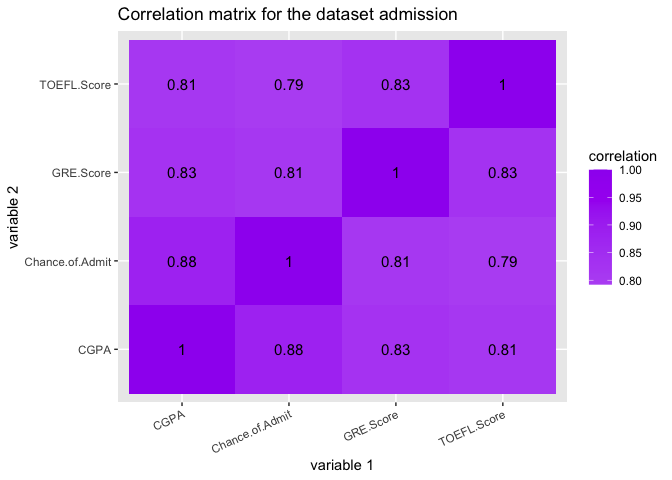<!-- -->

``` r
# building a correlation matrix with univariate and bivariate graphs
pairs.panels(adm_num, 
             method = "pearson", # correlation coefficient method
             hist.col = "blue", # color of histogram 
             smooth = FALSE, density = FALSE, ellipses = FALSE)
```

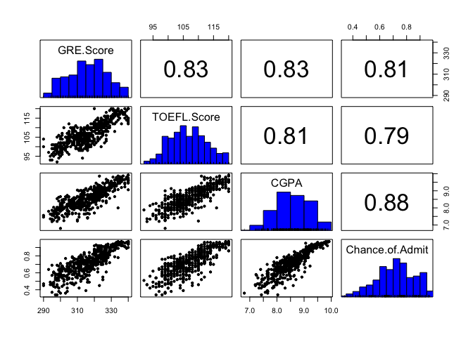<!-- -->

We can see that the correlations of all numeric variables are really
high and have clear patterns.

``` r
# Create boxplot of University rank and chance of admit
ggplot(data = admission,aes(x = University.Rating ,y = Chance.of.Admit)) +
  geom_boxplot() +
  ggtitle('Boxplot of University rank and chance of admit')
```

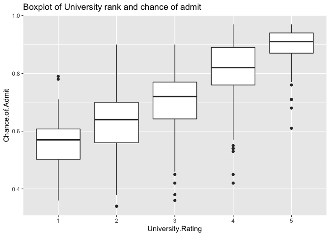<!-- -->

We can observe that chance of admission is higher when somebody belongs
to higher rating university. But there are still some outliers show that
high rating university students may have relatively low chance of admit.

``` r
# Create Boxplot of statement of purpose and chance of admit
ggplot(data = admission,aes(x = SOP ,y = Chance.of.Admit)) +
  geom_boxplot() +
  ggtitle('Boxplot of statement of purpose and chance of admit')
```

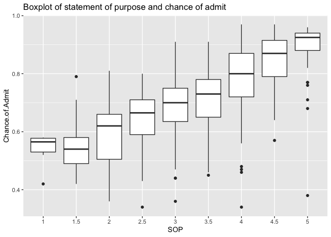<!-- -->

This graph shows that high degree of Statement of Purpose means high
probability of getting admission. However, there are still several
outliers to have high degree of SOP with a low chance of admit.

``` r
# Create Boxplot of letter of recomendation and chance of admit
ggplot(data = admission,aes(x = LOR ,y = Chance.of.Admit)) +
  geom_boxplot() +
  ggtitle('Boxplot of letter of recomendation and chance of admit')
```

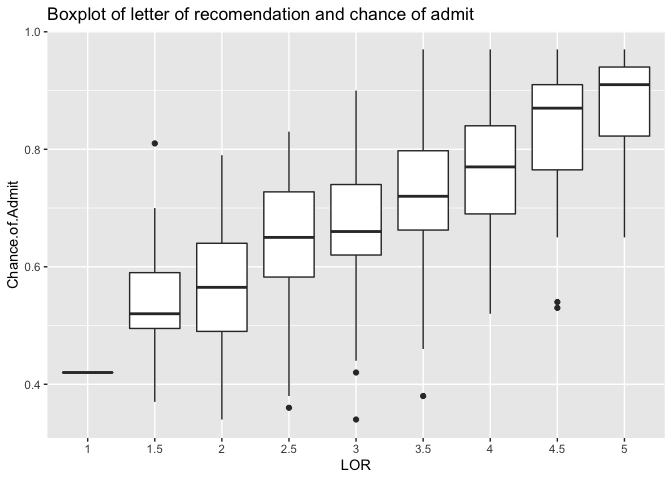<!-- -->

This graph shows that high degree of Letter of Recommendation means high
probability of getting admission.

``` r
# Create Boxplot of research and chance of admit
ggplot(data = admission,aes(x = Research ,y = Chance.of.Admit)) +
  geom_boxplot() +
  ggtitle('Boxplot of research and chance of admit')
```

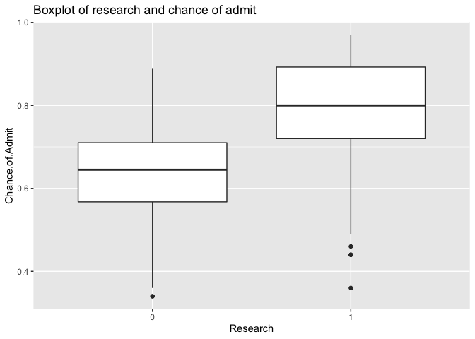<!-- -->

It clearly shows that students who have done reserch works have better
chance of getting admission in the
university.

## MANOVA

``` r
# How do the means of GRE score and CGPA differ between University Rating ?
admission %>%
  group_by(University.Rating) %>%
  summarize(mean(GRE.Score), mean(CGPA))
```

    ## # A tibble: 5 x 3
    ##   University.Rating `mean(GRE.Score)` `mean(CGPA)`
    ## * <fct>                         <dbl>        <dbl>
    ## 1 1                              305.         7.80
    ## 2 2                              309.         8.18
    ## 3 3                              315.         8.50
    ## 4 4                              323.         8.94
    ## 5 5                              328.         9.28

From the table, students in higher university rating tend to have higher
GRE score and CGPA. As the rating increasing, GRE and CGPA increase as
well.

``` r
# Scale the CGPA considering GRE to make the graph clearer
# The original GRE score is 34 times CGPA
temp = admission %>%
  mutate(temp_GPA = 34*CGPA)

# Represent the means per rating
temp %>%
  select(University.Rating,GRE.Score,temp_GPA) %>%
  pivot_longer(-1,names_to='DV', values_to='measure') %>%
  ggplot(aes(University.Rating,measure,fill=University.Rating)) +
  geom_bar(stat="summary", fun = "mean") +
  geom_errorbar(stat="summary", fun.data = "mean_se", width=.5) +
  facet_wrap(~DV, nrow=2) +
  coord_flip() + 
  ylab("") + 
  theme(legend.position = "none")
```

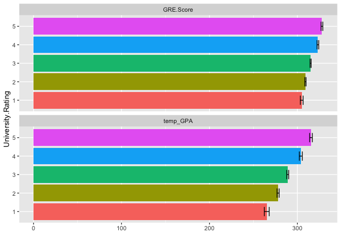<!-- -->

CGPA tend to have more difference in terms of University rating than GRE
score.

``` r
# Perform MANOVA with 2 response variables listed in cbind()
manova_adm <- manova(cbind(GRE.Score,CGPA) ~ University.Rating, data = admission)
summary(manova_adm)
```

    ##                    Df  Pillai approx F num Df den Df    Pr(>F)    
    ## University.Rating   4 0.51854   43.314      8    990 < 2.2e-16 ***
    ## Residuals         495                                             
    ## ---
    ## Signif. codes:  0 '***' 0.001 '**' 0.01 '*' 0.05 '.' 0.1 ' ' 1

A one-way MANOVA was conducted to determine the effect of the University
rating on two dependent variables GRE.Score and CGPA. Significant
differences were found among the five rating for at least one of the
dependent variables (Pillai’s trace = 0.519, pseudo F = 43.314, p\<
.0001).

``` r
# If MANOVA is significant then we can perform one-way ANOVA for each variable
summary.aov(manova_adm)
```

    ##  Response GRE.Score :
    ##                    Df Sum Sq Mean Sq F value    Pr(>F)    
    ## University.Rating   4  26083  6520.7  85.891 < 2.2e-16 ***
    ## Residuals         495  37580    75.9                      
    ## ---
    ## Signif. codes:  0 '***' 0.001 '**' 0.01 '*' 0.05 '.' 0.1 ' ' 1
    ## 
    ##  Response CGPA :
    ##                    Df Sum Sq Mean Sq F value    Pr(>F)    
    ## University.Rating   4 91.107 22.7767  123.32 < 2.2e-16 ***
    ## Residuals         495 91.426  0.1847                      
    ## ---
    ## Signif. codes:  0 '***' 0.001 '**' 0.01 '*' 0.05 '.' 0.1 ' ' 1

``` r
# If ANOVA is significant then we can perform post-hoc analysis
# For sepal length
pairwise.t.test(admission$GRE.Score,admission$University.Rating, p.adj="none")
```

    ## 
    ##  Pairwise comparisons using t tests with pooled SD 
    ## 
    ## data:  admission$GRE.Score and admission$University.Rating 
    ## 
    ##   1       2       3       4     
    ## 2 0.0125  -       -       -     
    ## 3 1.5e-09 2.1e-08 -       -     
    ## 4 < 2e-16 < 2e-16 1.7e-13 -     
    ## 5 < 2e-16 < 2e-16 < 2e-16 0.0006
    ## 
    ## P value adjustment method: none

``` r
# For petal width
pairwise.t.test(admission$CGPA,admission$University.Rating, p.adj="none")
```

    ## 
    ##  Pairwise comparisons using t tests with pooled SD 
    ## 
    ## data:  admission$CGPA and admission$University.Rating 
    ## 
    ##   1       2       3       4      
    ## 2 6.3e-06 -       -       -      
    ## 3 < 2e-16 6.0e-10 -       -      
    ## 4 < 2e-16 < 2e-16 4.1e-15 -      
    ## 5 < 2e-16 < 2e-16 < 2e-16 2.7e-07
    ## 
    ## P value adjustment method: none

Univariate ANOVAs for each dependent variable were conducted as
follow-up tests to the MANOVA, were also significant for GRE.Score (F =
85.891, p\< .0001) and CGPA (F = 123.32, p\< .0001).

``` r
# num of tests
num_test = 1 + 2 + 10 * 2
num_test
```

    ## [1] 23

``` r
# Type-I error
1 - 0.95^num_test
```

    ## [1] 0.6926431

``` r
# Bonferroni adjusted) significance level
0.05/num_test
```

    ## [1] 0.002173913

Post hoc analysis was performed conducting pairwise comparisons to
determine which University rating differed in GRE score and CGPA. All
five University ratings were found to differ significantly from each
other in terms of CGPA after adjusting for multiple comparisons
(Bonferroni = 0.00217. In terms of GRE score, excluding rating 1 and 2,
other pairs were found to differ significantly from each other.

#### MANOVA -Assumptions

•Random sample and independent observations •Multivariate normality of
the numeric response variables •Homogeneity of within-groups covariance
matrices •Linear relationships among response variables but no
multicollinearity •No extreme univariate or multivariate outliers

There may be outliers and the variance may not be equal.

## Randomization test

``` r
# Calculate the mean difference between the two conditions
true_diff <- admission %>%
  group_by(Research) %>%
  summarize(means = mean(Chance.of.Admit)) %>%
  summarize(mean_diff = diff(means)) %>%
  pull
true_diff
```

    ## [1] 0.1550552

``` r
## Repeat randomization many times 
# Create an empty vector to store the mean differences 
mean_diff <- vector()

# Create many randomizations with a for loop
for(i in 1:5000){ 
  temp <- data.frame(research = admission$Research, chance = sample(admission$Chance.of.Admit)) 
  
  mean_diff[i] <- temp %>% 
    group_by(research) %>%
    summarize(means = mean(chance)) %>%
    summarize(mean_diff = diff(means)) %>%
    pull
}
```

``` r
# Represent the distribution of the mean differences with a vertical line showing the true difference
{hist(mean_diff, main="Distribution of the mean differences"); abline(v = 0.155, col="red")}
```

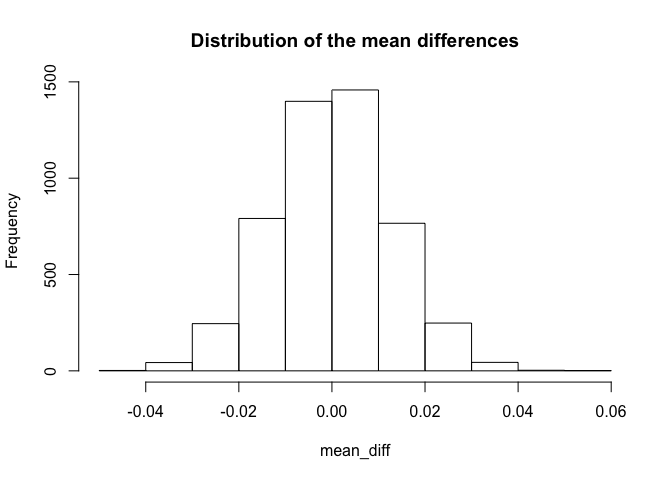<!-- -->

``` r
# Calculate the corresponding two-sided p-value
mean(mean_diff > true_diff | mean_diff < -true_diff)
```

    ## [1] 0

The p-value by randomization is 0, which means that we can reject the
null and conclude that there is a significant difference between the two
groups. (There is almost no possibility that the sample from the normal
distribution has a diff which is greater than the observation diff,
which means our observation diff is really
significant.)

## Linear Regression

``` r
# Center the data around the means (the intercept becomes more informative)
admission$GRE_c <- admission$GRE.Score - mean(admission$GRE.Score)

# Include an interaction term in the regression model with centered predictors
fit_c <- lm(Chance.of.Admit ~ Research * GRE_c, data = admission)
summary(fit_c)
```

    ## 
    ## Call:
    ## lm(formula = Chance.of.Admit ~ Research * GRE_c, data = admission)
    ## 
    ## Residuals:
    ##       Min        1Q    Median        3Q       Max 
    ## -0.298869 -0.038854  0.008835  0.054208  0.184687 
    ## 
    ## Coefficients:
    ##                  Estimate Std. Error t value Pr(>|t|)    
    ## (Intercept)     0.6913698  0.0071194  97.111  < 2e-16 ***
    ## Research1       0.0422899  0.0090396   4.678 3.74e-06 ***
    ## GRE_c           0.0078724  0.0006373  12.353  < 2e-16 ***
    ## Research1:GRE_c 0.0021193  0.0008038   2.637  0.00864 ** 
    ## ---
    ## Signif. codes:  0 '***' 0.001 '**' 0.01 '*' 0.05 '.' 0.1 ' ' 1
    ## 
    ## Residual standard error: 0.08096 on 496 degrees of freedom
    ## Multiple R-squared:  0.6729, Adjusted R-squared:  0.671 
    ## F-statistic: 340.2 on 3 and 496 DF,  p-value: < 2.2e-16

For people with average GRE, students with research have predicted
chance of admit that is 0.0423 unit higher than student with no research
(t = 4.678, p \< 0.0001).

GRE is significantly associated with chance of admit for student with no
research: for every 1-unit increase in GRE, the chance of admit goes up
by 0.0079 unit (t = 12.353, p \< 0.0001).

There is a significant interaction between GRE and research category.
The slope for GRE on chance of admit is 0.0021 higher for students with
research compared to student without research group (t = 2.637, p =
00864).

My model explains 67% of the variation in the response.

``` r
predict_admit = predict(fit_c, admission)
#Combining Predicted Value to Original Data
new_data = cbind(admission,predict_admit) 
head(new_data)
```

    ##   Serial.No. GRE.Score TOEFL.Score University.Rating SOP LOR CGPA Research
    ## 1          1       337         118                 4 4.5 4.5 9.65        1
    ## 2          2       324         107                 4   4 4.5 8.87        1
    ## 3          3       316         104                 3   3 3.5 8.00        1
    ## 4          4       322         110                 3 3.5 2.5 8.67        1
    ## 5          5       314         103                 2   2   3 8.21        0
    ## 6          6       330         115                 5 4.5   3 9.34        1
    ##   Chance.of.Admit  GRE_c predict_admit
    ## 1            0.92 20.528     0.9387692
    ## 2            0.76  7.528     0.8088771
    ## 3            0.72 -0.472     0.7289436
    ## 4            0.80  5.528     0.7888937
    ## 5            0.65 -2.472     0.6719093
    ## 6            0.90 13.528     0.8688273

``` r
# Visualize the relationships between the three variables
ggplot(admission, aes(x = GRE.Score, y = Chance.of.Admit, color = Research)) +
  geom_point() +
  geom_smooth(method=lm, se=FALSE, fullrange=TRUE) + 
  ggtitle("relationship between the variables")
```

    ## `geom_smooth()` using formula 'y ~ x'

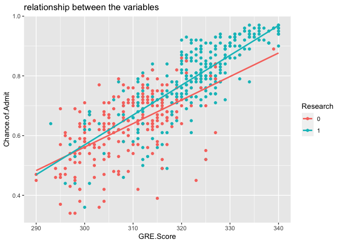<!-- -->

There is clearly an interaction between the 2 variables on the response.

``` r
# Residuals vs Fitted values plot
plot(fit_c, which = 1)
```

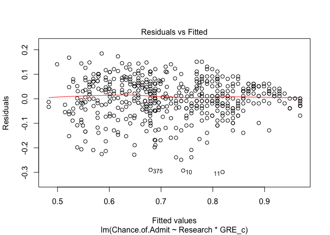<!-- -->

``` r
# Histogram of residuals
hist(fit_c$residuals)
```

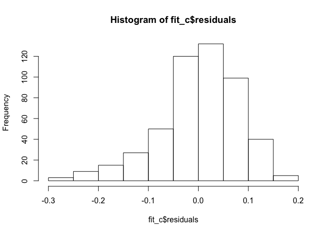<!-- -->

``` r
# Q-Q plot for the residuals
plot(fit_c, which = 2)
```

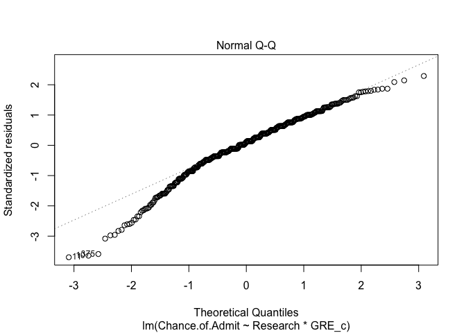<!-- -->

``` r
# Shapiro-Wilk test
# H0: normality
shapiro.test(fit_c$residuals)
```

    ## 
    ##  Shapiro-Wilk normality test
    ## 
    ## data:  fit_c$residuals
    ## W = 0.96639, p-value = 2.763e-09

``` r
library(sandwich);
# Install a new package
# install.packages("lmtest")
library(lmtest)
```

    ## Loading required package: zoo

    ## 
    ## Attaching package: 'zoo'

    ## The following objects are masked from 'package:base':
    ## 
    ##     as.Date, as.Date.numeric

``` r
# Breusch-Pagan test
# H0: homoscedasticity
bptest(fit_c) 
```

    ## 
    ##  studentized Breusch-Pagan test
    ## 
    ## data:  fit_c
    ## BP = 19.895, df = 3, p-value = 0.0001785

From both the test and the visualization, we can conclude that the
assumptions of normality and homoscedasticity are failed to met. The
linearity assumption can be checked by inspecting the Residuals vs
Fitted plot. The red line is approximately horizontal at zero, so the
linearity assumption is met.

``` r
# Uncorrected Standard Errors
summary(fit_c)$coef
```

    ##                    Estimate   Std. Error   t value     Pr(>|t|)
    ## (Intercept)     0.691369781 0.0071193754 97.111016 0.000000e+00
    ## Research1       0.042289859 0.0090396050  4.678286 3.736013e-06
    ## GRE_c           0.007872377 0.0006373041 12.352623 9.477602e-31
    ## Research1:GRE_c 0.002119321 0.0008038069  2.636604 8.636617e-03

``` r
# Robust Standard Errors
# install.packages("sandwich")
library(sandwich)
coeftest(fit_c, vcov = vcovHC(fit_c))
```

    ## 
    ## t test of coefficients:
    ## 
    ##                   Estimate Std. Error t value  Pr(>|t|)    
    ## (Intercept)     0.69136978 0.00817655 84.5552 < 2.2e-16 ***
    ## Research1       0.04228986 0.01019056  4.1499 3.914e-05 ***
    ## GRE_c           0.00787238 0.00073763 10.6726 < 2.2e-16 ***
    ## Research1:GRE_c 0.00211932 0.00087631  2.4185   0.01594 *  
    ## ---
    ## Signif. codes:  0 '***' 0.001 '**' 0.01 '*' 0.05 '.' 0.1 ' ' 1

After Robust Standard Errors, the results are still significant, but the
p-values are all greater than before. The SEs are also larger.

``` r
##  Bootstrap from observations
# Repeat bootstrapping 5000 times, saving the coefficients each time
samp_SEs <- replicate(5000, {
  # Bootstrap your data (resample observations)
  boot_data <- sample_frac(admission, replace = TRUE)
  # Fit regression model
  fitboot <- lm(Chance.of.Admit ~ Research * GRE_c, data = boot_data)
  # Save the coefficients
  coef(fitboot)
})

# Estimated SEs
samp_SEs %>%
  # Transpose the obtained matrices
  t %>%
  # Consider the matrix as a data frame
  as.data.frame %>%
  # Compute the standard error (standard deviation of the sampling distribution)
  summarize_all(sd)
```

    ##   (Intercept)  Research1       GRE_c Research1:GRE_c
    ## 1 0.008138989 0.01010445 0.000734375    0.0008716945

``` r
# Compare with normal-theory SEs
coeftest(fit_c)[,1:2]
```

    ##                    Estimate   Std. Error
    ## (Intercept)     0.691369781 0.0071193754
    ## Research1       0.042289859 0.0090396050
    ## GRE_c           0.007872377 0.0006373041
    ## Research1:GRE_c 0.002119321 0.0008038069

``` r
# Compare with robust SEs
coeftest(fit_c, vcov = vcovHC(fit_c))[,1:2]
```

    ##                    Estimate   Std. Error
    ## (Intercept)     0.691369781 0.0081765496
    ## Research1       0.042289859 0.0101905611
    ## GRE_c           0.007872377 0.0007376262
    ## Research1:GRE_c 0.002119321 0.0008763061

The Boostrap method and Robust Standard Errors method both increase the
SE to make it harder to reject the null under the situation that there
are several assumptions we did not met.

## Logistic Regression

I want to predict whether the student gets admitted or not, but there is
no actual variable for that, so I am going to modify the chance of Admit
to a dummy variable, with 0 not, 1 yes. Since the mean and median are
all around 0.72, I will choose 0.72 to be the cut
off.

``` r
# Add a new variable 'admit' which changes the chance of admit to a catagorical variable
modified <- admission %>% 
  mutate(admit = ifelse(Chance.of.Admit > 0.72, 1, 0))
modified$admit = as.factor(modified$admit)
head(modified)
```

    ##   Serial.No. GRE.Score TOEFL.Score University.Rating SOP LOR CGPA Research
    ## 1          1       337         118                 4 4.5 4.5 9.65        1
    ## 2          2       324         107                 4   4 4.5 8.87        1
    ## 3          3       316         104                 3   3 3.5 8.00        1
    ## 4          4       322         110                 3 3.5 2.5 8.67        1
    ## 5          5       314         103                 2   2   3 8.21        0
    ## 6          6       330         115                 5 4.5   3 9.34        1
    ##   Chance.of.Admit  GRE_c admit
    ## 1            0.92 20.528     1
    ## 2            0.76  7.528     1
    ## 3            0.72 -0.472     0
    ## 4            0.80  5.528     1
    ## 5            0.65 -2.472     0
    ## 6            0.90 13.528     1

``` r
#Fit the logistic model considering CGPA, GRE, and research
model = glm(admit ~ CGPA + GRE.Score + Research, data = modified, family = binomial(link="logit"))
summary(model)
```

    ## 
    ## Call:
    ## glm(formula = admit ~ CGPA + GRE.Score + Research, family = binomial(link = "logit"), 
    ##     data = modified)
    ## 
    ## Deviance Residuals: 
    ##      Min        1Q    Median        3Q       Max  
    ## -2.55711  -0.38396  -0.02826   0.31961   2.41225  
    ## 
    ## Coefficients:
    ##              Estimate Std. Error z value Pr(>|z|)    
    ## (Intercept) -63.91413    7.42160  -8.612  < 2e-16 ***
    ## CGPA          3.91821    0.54536   7.185 6.74e-13 ***
    ## GRE.Score     0.09378    0.02552   3.675 0.000238 ***
    ## Research1     1.19725    0.32245   3.713 0.000205 ***
    ## ---
    ## Signif. codes:  0 '***' 0.001 '**' 0.01 '*' 0.05 '.' 0.1 ' ' 1
    ## 
    ## (Dispersion parameter for binomial family taken to be 1)
    ## 
    ##     Null deviance: 693.12  on 499  degrees of freedom
    ## Residual deviance: 277.77  on 496  degrees of freedom
    ## AIC: 285.77
    ## 
    ## Number of Fisher Scoring iterations: 6

``` r
# Interpret the coefficients by considering the odds (inverse of log(odds))
exp(coef(model))
```

    ##  (Intercept)         CGPA    GRE.Score    Research1 
    ## 1.747624e-28 5.031010e+01 1.098317e+00 3.310984e+00

While holding other predictors constant,

Holding GRE.score constant, a one-unit increase in CGPA without research
- increases the log-odds of getting admitted by 3.9182.  
\- multiplies the odds of malignancy by a factor of 50.31.

Holding CGPA constant, a one-unit increase in GRE score without research
- increases the log-odds of getting admitted by 0.0938.  
\- multiplies the odds of malignancy by a factor of 1.098.

Research1: 1.1972, this is the effect on the log odds of an applicant
being confident for an applicant with a Research background.

``` r
# Add predicted probabilities to the dataset
modified$prob <- predict(model, type = "response")

modified$predicted <- ifelse(modified$prob > .5, 1, 0) 

# Confusion matrix
table(truth = modified$admit, prediction = modified$predicted) %>%
  addmargins
```

    ##      prediction
    ## truth   0   1 Sum
    ##   0   223  29 252
    ##   1    33 215 248
    ##   Sum 256 244 500

``` r
# Accuracy (correctly classified cases)
(223 + 215)/500 
```

    ## [1] 0.876

``` r
# Sensitivity (True Positive Rate, TPR)
215/248
```

    ## [1] 0.8669355

``` r
# Specificity (True Negative Rate, TNR)
223/252 
```

    ## [1] 0.8849206

``` r
# Precision (Positive Predictive Value, PPV)
215/244
```

    ## [1] 0.8811475

The Accuracy, Sensitivity (TPR), Specificity (TNR), and Recall (PPV) are
all close to 0.9, which is not bad.

``` r
# Predicted log odds 
modified$logit <- predict(model, type = "link") 

# Density plot of log-odds for each outcome
modified %>%
  ggplot() + 
  geom_density(aes(logit, color = admit, fill = admit), alpha = .4)+
    geom_rug(aes(logit, color = admit)) +
  geom_text(x = -3, y = .07, label = "TN = 223") +
  geom_text(x = -1.75, y = .008, label = "FN = 33") +
  geom_text(x = 1, y = .006, label = "FP = 29") +
  geom_text(x = 5, y = .04, label = "TP = 215") +
  theme(legend.position = c(.85,.85)) +
  geom_vline(xintercept = 0) + 
  xlab("logit (log-odds)") +
  ggtitle("Density plot of log-odds for admit")
```

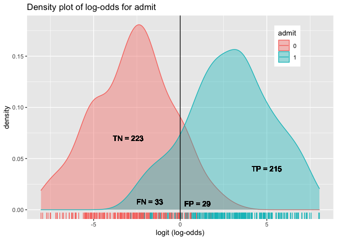<!-- -->

``` r
# Call the library plotROC
library(plotROC) 
head(modified)
```

    ##   Serial.No. GRE.Score TOEFL.Score University.Rating SOP LOR CGPA Research
    ## 1          1       337         118                 4 4.5 4.5 9.65        1
    ## 2          2       324         107                 4   4 4.5 8.87        1
    ## 3          3       316         104                 3   3 3.5 8.00        1
    ## 4          4       322         110                 3 3.5 2.5 8.67        1
    ## 5          5       314         103                 2   2   3 8.21        0
    ## 6          6       330         115                 5 4.5   3 9.34        1
    ##   Chance.of.Admit  GRE_c admit       prob predicted     logit
    ## 1            0.92 20.528     1 0.99876723         1  6.697260
    ## 2            0.76  7.528     1 0.91848473         1  2.421935
    ## 3            0.72 -0.472     0 0.14967728         0 -1.737134
    ## 4            0.80  5.528     1 0.81011171         1  1.450736
    ## 5            0.65 -2.472     0 0.09119635         0 -2.299114
    ## 6            0.90 13.528     1 0.99204655         1  4.826164

``` r
# Plot ROC depending on values of y and its probabilities displaying some cutoff values
ROCplot1 <- ggplot(modified) + 
  geom_roc(aes(d = as.numeric(admit), m = prob), cutoffs.at = list(0.1, 0.5, 0.9))
  
ROCplot1
```

    ## Warning in verify_d(data$d): D not labeled 0/1, assuming 1 = 0 and 2 = 1!

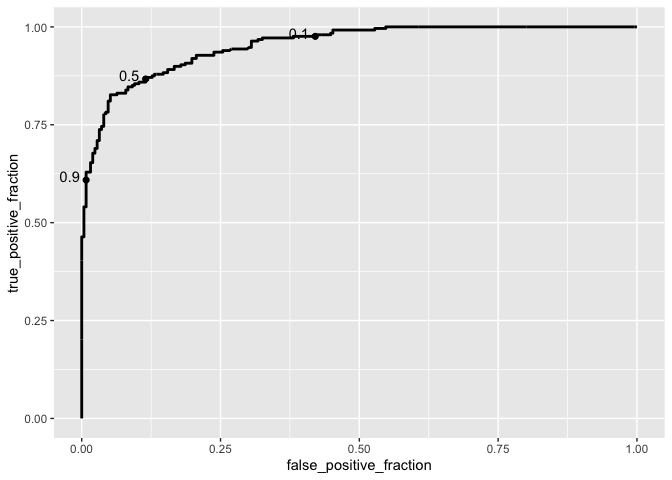<!-- -->

``` r
# Calculate the area under the curve still using the library plotROC with function calc_auc
calc_auc(ROCplot1)
```

    ## Warning in verify_d(data$d): D not labeled 0/1, assuming 1 = 0 and 2 = 1!

    ##   PANEL group      AUC
    ## 1     1    -1 0.952781

The higher the area under the curve the better prediction power the
model has. 0.95 in this model is considered a really great performance.
A randomly selected student from the admitted group has a test value
larger than for a randomly chosen student from the fail-to -admit group
95.3 percent of the time.

Reference:

dataset: <https://www.kaggle.com/mohansacharya/graduate-admissions>
