Project 1
================
Huiqian Wang hw8849
3/17/2021

## Relationship between Happiness and specific country factors

### Introduction

I was curious about how happy people are in different countries, how
they feel about living in their own country, and what factors make them
rate happiness, so I found the happiness report of the world. I was also
wondering whether other factors related to the happiness score, which
makes me find other four datasets about the countries, which including
two variables that show in details as the extensions in the happiness
report (GDP per capita and Life expectancy).

The original dataset I chose is the world happiness report in 2016 from
Kaggle
(<https://www.kaggle.com/unsdsn/world-happiness?select=2016.csv>). This
dataset reviews the state of happiness in the world today and shows how
the new science of happiness explains personal and national variations
in happiness. It contains 15 variables, including Country, Region,
Happiness Rank, Happiness Score, Lower Confidence Interval, Upper
Confidence Interval, Economy (GDP per Capita), Family, Health (Life
Expectancy), Freedom, Trust (Government Corruption), Generosity, and
Dystopia Residual. The following columns: GDP per Capita, Family, Life
Expectancy, Freedom, Generosity, Trust(Government Corruption) describe
the extent to which these factors contribute in evaluating the happiness
in each country.

The other four datasets are also from Kaggle
(<https://www.kaggle.com/daniboy370/world-data-by-country-2020?select=Meat+consumption.csv>),
which are GDP per capita dataset(A list of countries of the world by
gross domestic product (at purchasing power parity) per capita), Life
expectancy dataset(Life expectancy is a statistical measure of the
average (see below) time an organism is expected to live, based on the
year of its birth, its current age, and other demographic factors
including gender.), Meat consumption dataset(Meat consumption by kg per
capita as published by the Food and Agriculture Organization of the
United Nations (FAO)), and Suicide rate dataset(This lists of countries
contains the suicide rate as per data published by the World Health
Organization (WHO)). They all contain three variables, Country, itself,
and ISO-code. We will remove the ISO-code and combine all four datasets
by country.

``` r
# import the world happiness report data
library(readr)
happiness <- read_csv("2016.csv")
```

    ## Parsed with column specification:
    ## cols(
    ##   Country = col_character(),
    ##   Region = col_character(),
    ##   `Happiness Rank` = col_double(),
    ##   `Happiness Score` = col_double(),
    ##   `Lower Confidence Interval` = col_double(),
    ##   `Upper Confidence Interval` = col_double(),
    ##   `Economy (GDP per Capita)` = col_double(),
    ##   Family = col_double(),
    ##   `Health (Life Expectancy)` = col_double(),
    ##   Freedom = col_double(),
    ##   `Trust (Government Corruption)` = col_double(),
    ##   Generosity = col_double(),
    ##   `Dystopia Residual` = col_double()
    ## )

``` r
happiness
```

    ## # A tibble: 157 x 13
    ##    Country Region `Happiness Rank` `Happiness Scor… `Lower Confiden…
    ##    <chr>   <chr>             <dbl>            <dbl>            <dbl>
    ##  1 Denmark Weste…                1             7.53             7.46
    ##  2 Switze… Weste…                2             7.51             7.43
    ##  3 Iceland Weste…                3             7.50             7.33
    ##  4 Norway  Weste…                4             7.50             7.42
    ##  5 Finland Weste…                5             7.41             7.35
    ##  6 Canada  North…                6             7.40             7.34
    ##  7 Nether… Weste…                7             7.34             7.28
    ##  8 New Ze… Austr…                8             7.33             7.26
    ##  9 Austra… Austr…                9             7.31             7.24
    ## 10 Sweden  Weste…               10             7.29             7.23
    ## # … with 147 more rows, and 8 more variables: `Upper Confidence
    ## #   Interval` <dbl>, `Economy (GDP per Capita)` <dbl>, Family <dbl>, `Health
    ## #   (Life Expectancy)` <dbl>, Freedom <dbl>, `Trust (Government
    ## #   Corruption)` <dbl>, Generosity <dbl>, `Dystopia Residual` <dbl>

``` r
# import the world GDP_per_capita data
GDP_per_capita <- read_csv("GDP per capita.csv")
```

    ## Parsed with column specification:
    ## cols(
    ##   Country = col_character(),
    ##   `GDP per capita` = col_double(),
    ##   `ISO-code` = col_character()
    ## )

``` r
# remove the ISO-code column
GDP_per_capita$`ISO-code` <- NULL
GDP_per_capita
```

    ## # A tibble: 191 x 2
    ##    Country             `GDP per capita`
    ##    <chr>                          <dbl>
    ##  1 Afghanistan                     2182
    ##  2 Albania                        14866
    ##  3 Algeria                        16091
    ##  4 Angola                          6763
    ##  5 Antigua and Barbuda            30593
    ##  6 Argentina                      19971
    ##  7 Armenia                        11845
    ##  8 Australia                      54799
    ##  9 Austria                        55171
    ## 10 Azerbaijan                     19156
    ## # … with 181 more rows

``` r
# import the world Life expectancy data
life_exp <- read_csv("Life expectancy.csv")
```

    ## Parsed with column specification:
    ## cols(
    ##   Country = col_character(),
    ##   `Life expectancy` = col_double(),
    ##   `ISO-code` = col_character()
    ## )

``` r
# remove the ISO-code column
life_exp$`ISO-code` <- NULL
life_exp
```

    ## # A tibble: 185 x 2
    ##    Country             `Life expectancy`
    ##    <chr>                           <dbl>
    ##  1 Afghanistan                      64.5
    ##  2 Algeria                          76.7
    ##  3 Andorra                          81.8
    ##  4 Angola                           60.8
    ##  5 Antigua and Barbuda              76.9
    ##  6 Argentina                        76.5
    ##  7 Armenia                          74.9
    ##  8 Australia                        83.3
    ##  9 Austria                          81.4
    ## 10 Azerbaijan                       72.9
    ## # … with 175 more rows

``` r
# import the world Meat consumption data
meat <- read_csv("Meat consumption.csv")
```

    ## Parsed with column specification:
    ## cols(
    ##   Country = col_character(),
    ##   `Meat consumption` = col_double(),
    ##   `ISO-code` = col_character()
    ## )

``` r
# remove the ISO-code column
meat$`ISO-code` <- NULL
meat
```

    ## # A tibble: 187 x 2
    ##    Country             `Meat consumption`
    ##    <chr>                            <dbl>
    ##  1 Afghanistan                       17.3
    ##  2 Algeria                           18.3
    ##  3 American Samoa                    24.9
    ##  4 Angola                            19  
    ##  5 Antigua and Barbuda               56  
    ##  6 Argentina                         79.7
    ##  7 Armenia                           27.7
    ##  8 Australia                        108. 
    ##  9 Austria                           94.1
    ## 10 Azerbaijan                        15.9
    ## # … with 177 more rows

``` r
# import the world Suicide rate data
suicide <- read_csv("Suicide rate.csv")
```

    ## Parsed with column specification:
    ## cols(
    ##   Country = col_character(),
    ##   `Suicide rate` = col_double(),
    ##   `ISO-code` = col_character()
    ## )

``` r
# remove the ISO-code column
suicide$`ISO-code` <- NULL
suicide
```

    ## # A tibble: 182 x 2
    ##    Country             `Suicide rate`
    ##    <chr>                        <dbl>
    ##  1 Afghanistan                    6.4
    ##  2 Albania                        5.6
    ##  3 Algeria                        3.3
    ##  4 Angola                         8.9
    ##  5 Antigua and Barbuda            0.5
    ##  6 Argentina                      9.1
    ##  7 Armenia                        5.7
    ##  8 Australia                     11.7
    ##  9 Austria                       11.4
    ## 10 Azerbaijan                     2.6
    ## # … with 172 more rows

``` r
library(tidyverse)
```

    ## ── Attaching packages ───────────────────────────────────────────────────── tidyverse 1.3.0 ──

    ## ✓ ggplot2 3.3.3     ✓ dplyr   1.0.3
    ## ✓ tibble  3.0.5     ✓ stringr 1.4.0
    ## ✓ tidyr   1.1.2     ✓ forcats 0.4.0
    ## ✓ purrr   0.3.3

    ## ── Conflicts ──────────────────────────────────────────────────────── tidyverse_conflicts() ──
    ## x dplyr::filter() masks stats::filter()
    ## x dplyr::lag()    masks stats::lag()

### Tidy

The world happiness data is originally tidy, so we only need to make a
new dataframe with all other datasets by
country.

``` r
# Combine the GDP_per_capita, Life expectancy, Meat consumption, and Suicide rate data into one dataset
my_data = 
  GDP_per_capita %>% 
  inner_join(life_exp, by = 'Country') %>%
  inner_join(meat, by = 'Country') %>%
  inner_join(suicide, by = 'Country') %>% 
  # remove the duplicate values
  distinct(Country, .keep_all = TRUE)

my_data
```

    ## # A tibble: 168 x 5
    ##    Country     `GDP per capita` `Life expectanc… `Meat consumpti… `Suicide rate`
    ##    <chr>                  <dbl>            <dbl>            <dbl>          <dbl>
    ##  1 Afghanistan             2182             64.5             17.3            6.4
    ##  2 Algeria                16091             76.7             18.3            3.3
    ##  3 Angola                  6763             60.8             19              8.9
    ##  4 Antigua an…            30593             76.9             56              0.5
    ##  5 Argentina              19971             76.5             79.7            9.1
    ##  6 Armenia                11845             74.9             27.7            5.7
    ##  7 Australia              54799             83.3            108.            11.7
    ##  8 Austria                55171             81.4             94.1           11.4
    ##  9 Azerbaijan             19156             72.9             15.9            2.6
    ## 10 Bahrain                51991             77.2             70.7            5.7
    ## # … with 158 more rows

### Join/Merge

I chose inner\_join. I lose 157 - 140 = 17 observations of happiness and
168 - 140 = 28 observations in the combined dataset of the four.
Although there will be much information missing by inner\_join, it helps
me get rid of NA values and keeps the matched rows in both tables.

``` r
# Combine the happiness dataset and my_data using inner join
new_data = 
  happiness %>% 
  inner_join(my_data, by = 'Country') %>%
  # Rename the column names to more easy-operate ones
  rename('HR' = 'Happiness Rank', 'SR' = 'Suicide rate', 'econ' = 'Economy (GDP per Capita)',
         'HS' = 'Happiness Score', 'MC' = 'Meat consumption', 
         'health' = 'Health (Life Expectancy)', 'trust' = 'Trust (Government Corruption)',
         'GDP' = 'GDP per capita', 'LE' = 'Life expectancy') 

new_data
```

    ## # A tibble: 140 x 17
    ##    Country Region    HR    HS `Lower Confiden… `Upper Confiden…  econ Family
    ##    <chr>   <chr>  <dbl> <dbl>            <dbl>            <dbl> <dbl>  <dbl>
    ##  1 Denmark Weste…     1  7.53             7.46             7.59  1.44  1.16 
    ##  2 Iceland Weste…     3  7.50             7.33             7.67  1.43  1.18 
    ##  3 Norway  Weste…     4  7.50             7.42             7.58  1.58  1.13 
    ##  4 Finland Weste…     5  7.41             7.35             7.48  1.41  1.13 
    ##  5 Canada  North…     6  7.40             7.34             7.47  1.44  1.10 
    ##  6 Nether… Weste…     7  7.34             7.28             7.39  1.46  1.03 
    ##  7 New Ze… Austr…     8  7.33             7.26             7.40  1.36  1.17 
    ##  8 Austra… Austr…     9  7.31             7.24             7.38  1.44  1.10 
    ##  9 Sweden  Weste…    10  7.29             7.23             7.36  1.45  1.09 
    ## 10 Israel  Middl…    11  7.27             7.20             7.34  1.34  0.995
    ## # … with 130 more rows, and 9 more variables: health <dbl>, Freedom <dbl>,
    ## #   trust <dbl>, Generosity <dbl>, `Dystopia Residual` <dbl>, GDP <dbl>,
    ## #   LE <dbl>, MC <dbl>, SR <dbl>

### Create summary statistics

Manipulate and explore my dataset:

It turns out that there is few relations between these two variables
since countries with low suicide rate turns out to have low happiness
score according the rank, which is the opposite of my
expectation.

``` r
# Get the hapiness rank and suiside rate variables for asian regions and arrange them based on suicide rate 

new_data %>%
  filter(grepl("Asia", Region)) %>%
  select(Country, 'HR', 'SR') %>% 
  arrange(SR)
```

    ## # A tibble: 19 x 3
    ##    Country        HR    SR
    ##    <chr>       <dbl> <dbl>
    ##  1 Pakistan       92   3.1
    ##  2 Indonesia      79   3.7
    ##  3 Philippines    82   3.7
    ##  4 Cambodia      140   5.9
    ##  5 Bangladesh    110   6.1
    ##  6 Malaysia       47   6.2
    ##  7 Afghanistan   154   6.4
    ##  8 Vietnam        96   7  
    ##  9 Singapore      22   7.9
    ## 10 China          83   8  
    ## 11 Myanmar       119   8.1
    ## 12 Laos          102   9.3
    ## 13 Nepal         107   9.6
    ## 14 Bhutan         84  11.6
    ## 15 Thailand       33  12.9
    ## 16 Mongolia      101  13.3
    ## 17 Sri Lanka     117  14.2
    ## 18 Japan          53  14.3
    ## 19 India         118  16.5

We can find out that people in Sub-Saharan Africa tend to give low score
based on GDP per capita in the happiness rating and those in Western
Europe give high score according to GDP per
capita.

``` r
# Create a new variable that measures the percent of GDP per capita in the total hapiness score and get the mean of this new variable based on region
new_data %>% 
  mutate(percent_GDP = econ / HS) %>%
  group_by(Region) %>%
  summarize(mean(percent_GDP))
```

    ## # A tibble: 10 x 2
    ##    Region                          `mean(percent_GDP)`
    ##  * <chr>                                         <dbl>
    ##  1 Australia and New Zealand                     0.192
    ##  2 Central and Eastern Europe                    0.195
    ##  3 Eastern Asia                                  0.210
    ##  4 Latin America and Caribbean                   0.160
    ##  5 Middle East and Northern Africa               0.208
    ##  6 North America                                 0.203
    ##  7 Southeastern Asia                             0.162
    ##  8 Southern Asia                                 0.144
    ##  9 Sub-Saharan Africa                            0.116
    ## 10 Western Europe                                0.214

Create summary
statistics:

``` r
# The original dataset contains so many numeric variables, so I only choose five of them, which are GDP per capita, Life expectancy, Meat consumption, Suicide rate, and Happiness score. The catagorical variables remain the same.
data1 = 
  new_data %>%
  select(c(Country, Region, GDP, LE, MC, SR, HS))

data1
```

    ## # A tibble: 140 x 7
    ##    Country     Region                            GDP    LE    MC    SR    HS
    ##    <chr>       <chr>                           <dbl> <dbl> <dbl> <dbl> <dbl>
    ##  1 Denmark     Western Europe                  55675  80.8 146.    9.2  7.53
    ##  2 Iceland     Western Europe                  56974  82.9  84.8  13.3  7.50
    ##  3 Norway      Western Europe                  79638  82.5  61.7  10.1  7.50
    ##  4 Finland     Western Europe                  49548  81.7  67.4  11.7  7.41
    ##  5 Canada      North America                   52144  82.3 108.   10.4  7.40
    ##  6 Netherlands Western Europe                  60299  82.1  89.3   9.6  7.34
    ##  7 New Zealand Australia and New Zealand       42045  82.1 142.   11.6  7.33
    ##  8 Australia   Australia and New Zealand       54799  83.3 108.   11.7  7.31
    ##  9 Sweden      Western Europe                  55989  82.7  76.1  13.8  7.29
    ## 10 Israel      Middle East and Northern Africa 40337  82.8  97.1   5.2  7.27
    ## # … with 130 more rows

``` r
# Mean for each of the numeric variables both overall and after grouping by Region 
means = data1 %>%
  summarise_if(is.numeric, mean, na.rm = TRUE) %>%
  mutate(statistics = 'mean') %>% 
  select(statistics, everything())

data1 %>%
  group_by(Region) %>%
  summarise_if(is.numeric, mean, na.rm = TRUE)
```

    ## # A tibble: 10 x 6
    ##    Region                             GDP    LE     MC    SR    HS
    ##  * <chr>                            <dbl> <dbl>  <dbl> <dbl> <dbl>
    ##  1 Australia and New Zealand       48422   82.7 125.   11.6   7.32
    ##  2 Central and Eastern Europe      24333.  74.8  48.3  12.4   5.43
    ##  3 Eastern Asia                    27633.  77.0  69.0  11.9   5.36
    ##  4 Latin America and Caribbean     15568.  74.8  49.5   8.79  6.06
    ##  5 Middle East and Northern Africa 27777.  75.4  39.4   4.42  5.51
    ##  6 North America                   59785   80.6 116.   12.0   7.25
    ##  7 Southeastern Asia               24015.  73.2  28.6   7.19  5.34
    ##  8 Southern Asia                    7338.  70.3   8.21  9.64  4.56
    ##  9 Sub-Saharan Africa               5280.  62.5  15.7  12.1   4.10
    ## 10 Western Europe                  55739.  82.0  95.4   9.47  6.69

``` r
# Minimum for each of the numeric variables both overall and after grouping by Region
mins = data1 %>%
  summarise_if(is.numeric, min, na.rm = TRUE) %>% 
  mutate(statistics = 'minimum') %>% 
  select(statistics, everything())

data1 %>%
  group_by(Region) %>%
  summarise_if(is.numeric, min, na.rm = TRUE)
```

    ## # A tibble: 10 x 6
    ##    Region                             GDP    LE    MC    SR    HS
    ##  * <chr>                            <dbl> <dbl> <dbl> <dbl> <dbl>
    ##  1 Australia and New Zealand       42045   82.1 108.   11.6  7.31
    ##  2 Central and Eastern Europe       3751   68.1   8.7   2.6  4.22
    ##  3 Eastern Asia                    15089   69.7  45.9   8    4.91
    ##  4 Latin America and Caribbean      1916   63.7  14.9   2    4.03
    ##  5 Middle East and Northern Africa  2312   66.1  14.7   2.2  3.72
    ##  6 North America                   52144   78.9 108.   10.4  7.10
    ##  7 Southeastern Asia                5004   66.9   8.3   3.7  3.91
    ##  8 Southern Asia                    2182   64.5   3     3.1  3.36
    ##  9 Sub-Saharan Africa                314.  54     3.5   5.6  2.90
    ## 10 Western Europe                  31616   80.8  61.7   3.8  5.03

``` r
# Standard deviation for each of the numeric variables both overall and after grouping by Region
sds = data1 %>%
  summarise_if(is.numeric, sd, na.rm = TRUE) %>% 
  mutate(statistics = 'standard deviation') %>% 
  select(statistics, everything())

data1 %>%
  group_by(Region) %>%
  summarise_if(is.numeric, sd, na.rm = TRUE)
```

    ## # A tibble: 10 x 6
    ##    Region                             GDP    LE    MC     SR     HS
    ##  * <chr>                            <dbl> <dbl> <dbl>  <dbl>  <dbl>
    ##  1 Australia and New Zealand        9018. 0.849 24.0  0.0707 0.0148
    ##  2 Central and Eastern Europe      12317. 3.18  24.2  6.72   0.627 
    ##  3 Eastern Asia                    16882. 7.40  34.6  3.39   0.516 
    ##  4 Latin America and Caribbean      8063. 3.39  22.6  5.01   0.713 
    ##  5 Middle East and Northern Africa 22367. 3.84  25.5  1.93   0.936 
    ##  6 North America                   10806. 2.40  11.8  2.33   0.212 
    ##  7 Southeastern Asia               31978. 5.36  20.7  2.86   0.931 
    ##  8 Southern Asia                    4308. 3.92   5.28 4.79   0.616 
    ##  9 Sub-Saharan Africa               5937. 4.44  10.6  4.34   0.559 
    ## 10 Western Europe                  18986. 0.794 23.6  3.24   0.780

``` r
# Maximum for each of the numeric variables both overall and after grouping by Region
maxs = data1 %>%
  summarise_if(is.numeric, max, na.rm = TRUE) %>% 
  mutate(statistics = 'maximum') %>% 
  select(statistics, everything())

data1 %>%
  group_by(Region) %>%
  summarise_if(is.numeric, max, na.rm = TRUE)
```

    ## # A tibble: 10 x 6
    ##    Region                             GDP    LE    MC    SR    HS
    ##  * <chr>                            <dbl> <dbl> <dbl> <dbl> <dbl>
    ##  1 Australia and New Zealand        54799  83.3 142.   11.7  7.33
    ##  2 Central and Eastern Europe       40585  81.2 101.   26.5  6.60
    ##  3 Eastern Asia                     46827  84.5 109.   14.3  5.92
    ##  4 Latin America and Caribbean      33713  80.1  98.6  23.2  7.09
    ##  5 Middle East and Northern Africa  70441  82.8  97.1   9.8  7.27
    ##  6 North America                    67426  82.3 125.   13.7  7.40
    ##  7 Southeastern Asia               105689  83.8  71.1  12.9  6.74
    ##  8 Southern Asia                    14509  76.8  17.3  16.5  5.20
    ##  9 Sub-Saharan Africa               26461  74.9  46    23    5.65
    ## 10 Western Europe                  112045  83.6 146.   15.7  7.53

``` r
# Variance for each of the numeric variables both overall and after grouping by Region
variances = data1 %>%
  summarise_if(is.numeric, var, na.rm = TRUE) %>% 
  mutate(statistics = 'variance') %>% 
  select(statistics, everything())

data1 %>%
  group_by(Region) %>%
  summarise_if(is.numeric, var, na.rm = TRUE)
```

    ## # A tibble: 10 x 6
    ##    Region                                  GDP     LE     MC       SR       HS
    ##  * <chr>                                 <dbl>  <dbl>  <dbl>    <dbl>    <dbl>
    ##  1 Australia and New Zealand         81332258   0.72   575.   0.00500 0.000220
    ##  2 Central and Eastern Europe       151712839. 10.1    586.  45.1     0.393   
    ##  3 Eastern Asia                     284985386. 54.8   1197.  11.5     0.267   
    ##  4 Latin America and Caribbean       65017759. 11.5    512.  25.1     0.509   
    ##  5 Middle East and Northern Africa  500301221. 14.8    651.   3.72    0.876   
    ##  6 North America                    116769762   5.78   139.   5.44    0.0450  
    ##  7 Southeastern Asia               1022596395. 28.8    430.   8.18    0.866   
    ##  8 Southern Asia                     18554612. 15.4     27.9 22.9     0.380   
    ##  9 Sub-Saharan Africa                35247738. 19.7    112.  18.8     0.313   
    ## 10 Western Europe                   360486987.  0.630  557.  10.5     0.608

``` r
# Distinct values in each of the numeric variables both overall and after grouping by Region
distinct = data1 %>%
  summarise_if(is.numeric, n_distinct, na.rm = TRUE) %>% 
  mutate(statistics = 'distinct values') %>% 
  select(statistics, everything())

data1 %>%
  group_by(Region) %>%
  summarise_if(is.numeric, n_distinct, na.rm = TRUE)
```

    ## # A tibble: 10 x 6
    ##    Region                            GDP    LE    MC    SR    HS
    ##  * <chr>                           <int> <int> <int> <int> <int>
    ##  1 Australia and New Zealand           2     2     2     2     2
    ##  2 Central and Eastern Europe         24    23    23    23    24
    ##  3 Eastern Asia                        3     3     3     3     3
    ##  4 Latin America and Caribbean        23    21    23    22    23
    ##  5 Middle East and Northern Africa    16    14    16    15    16
    ##  6 North America                       2     2     2     2     2
    ##  7 Southeastern Asia                   9     9     9     8     9
    ##  8 Southern Asia                       7     7     7     7     7
    ##  9 Sub-Saharan Africa                 35    27    31    32    34
    ## 10 Western Europe                     19    13    19    19    19

``` r
# Quantile(0, 25, 50, 75, 100 percent) for each of the numeric variables both overall and after grouping by Region
quantiles = data1 %>%
  summarize_if(is.numeric, quantile, na.rm = TRUE) %>% 
  mutate(statistics = 'quantile') %>% 
  select(statistics, everything())


data1 %>%
  group_by(Region) %>%
  summarize_if(is.numeric, quantile, na.rm = TRUE)
```

    ## # A tibble: 50 x 6
    ## # Groups:   Region [10]
    ##    Region                        GDP    LE    MC    SR    HS
    ##    <chr>                       <dbl> <dbl> <dbl> <dbl> <dbl>
    ##  1 Australia and New Zealand  42045   82.1 108.  11.6   7.31
    ##  2 Australia and New Zealand  45234.  82.4 117.  11.6   7.32
    ##  3 Australia and New Zealand  48422   82.7 125.  11.6   7.32
    ##  4 Australia and New Zealand  51610.  83   134.  11.7   7.33
    ##  5 Australia and New Zealand  54799   83.3 142.  11.7   7.33
    ##  6 Central and Eastern Europe  3751   68.1   8.7  2.6   4.22
    ##  7 Central and Eastern Europe 12861.  72.3  27.3  7.35  5.16
    ##  8 Central and Eastern Europe 27620.  74.9  47.6 11     5.54
    ##  9 Central and Eastern Europe 35724.  77.3  67.4 15.1   5.84
    ## 10 Central and Eastern Europe 40585   81.2 101.  26.5   6.60
    ## # … with 40 more rows

``` r
# Median for each of the numeric variables both overall and after grouping by Region
medians = data1 %>%
  summarize_if(is.numeric, median, na.rm = TRUE) %>% 
  mutate(statistics = 'median') %>% 
  select(statistics, everything())

data1 %>%
  group_by(Region) %>%
  summarize_if(is.numeric, median, na.rm = TRUE)
```

    ## # A tibble: 10 x 6
    ##    Region                             GDP    LE    MC    SR    HS
    ##  * <chr>                            <dbl> <dbl> <dbl> <dbl> <dbl>
    ##  1 Australia and New Zealand       48422   82.7 125.  11.6   7.32
    ##  2 Central and Eastern Europe      27620.  74.9  47.6 11     5.54
    ##  3 Eastern Asia                    20984   76.7  52.4 13.3   5.24
    ##  4 Latin America and Caribbean     16044   74.5  50    7.5   6.08
    ##  5 Middle East and Northern Africa 16962.  76.5  27.0  3.85  5.35
    ##  6 North America                   59785   80.6 116.  12.0   7.25
    ##  7 Southeastern Asia               10094   71.5  27.9  7     5.28
    ##  8 Southern Asia                    6016   70.5   6.6  9.6   4.64
    ##  9 Sub-Saharan Africa               2898   63.3  11.9 11.3   4.07
    ## 10 Western Europe                  50904   82.1  89.3  9.6   6.91

``` r
# Number of rows for the data both overall and after grouping by Region
data1 %>%
  summarize(n())
```

    ## # A tibble: 1 x 1
    ##   `n()`
    ##   <int>
    ## 1   140

``` r
data1 %>%
  group_by(Region) %>%
  summarize(n())
```

    ## # A tibble: 10 x 2
    ##    Region                          `n()`
    ##  * <chr>                           <int>
    ##  1 Australia and New Zealand           2
    ##  2 Central and Eastern Europe         24
    ##  3 Eastern Asia                        3
    ##  4 Latin America and Caribbean        23
    ##  5 Middle East and Northern Africa    16
    ##  6 North America                       2
    ##  7 Southeastern Asia                   9
    ##  8 Southern Asia                       7
    ##  9 Sub-Saharan Africa                 35
    ## 10 Western Europe                     19

``` r
# Create a correlation matrix for all numeric variables
data1_num = data1 %>%
  select_if(is.numeric) 
cor(data1_num, use = "pairwise.complete.obs")
```

    ##             GDP         LE          MC          SR          HS
    ## GDP  1.00000000  0.7313844  0.77321539 -0.01760733  0.73245212
    ## LE   0.73138444  1.0000000  0.72729895 -0.23147186  0.78889443
    ## MC   0.77321539  0.7272989  1.00000000 -0.01629362  0.72336040
    ## SR  -0.01760733 -0.2314719 -0.01629362  1.00000000 -0.08942764
    ## HS   0.73245212  0.7888944  0.72336040 -0.08942764  1.00000000

``` r
# get all the statistics and make a table based on the results
# note: the table does not contain the n() and cor stats results, which can be found above
stats = rbind(means, medians, mins, maxs, sds, variances, distinct, quantiles)
knitr::kable(stats, format = "latex", digits = 2)
```

### Make visualizations (three plots)

Make a correlation heatmap of the numeric variables(except
two):

``` r
# Remove the Lower Confidence Interval and Upper Confidence Interval columns
new_data = new_data %>%
  select(-c(5, 6))

data_num = new_data %>%
  select_if(is.numeric) 
# correlation heatmap for the whole dataset
cor(data_num, use = "pairwise.complete.obs") %>%
  # Save as a data frame
  as.data.frame %>%
  # Convert row names to an explicit variable
  rownames_to_column %>%
  # Pivot so that all correlations appear in the same column
  pivot_longer(-1, names_to = "other_var", values_to = "correlation") %>%
  ggplot(aes(rowname, other_var, fill=correlation)) +
  # Heatmap with geom_tile
  geom_tile() +
  # Change the scale to make the middle appear neutral
  scale_fill_gradient2(low="red",mid="white",high="blue") +
  # Overlay values
  geom_text(aes(label = round(correlation,2)), color = "black", size = 4) +
  # Give title and labels
  labs(title = "Correlation matrix for whole data", x = "variable 1", y = "variable 2") +
  # Rotate and adjust x axis text
  theme(axis.text.x = element_text(angle = 45, hjust = 1))
```

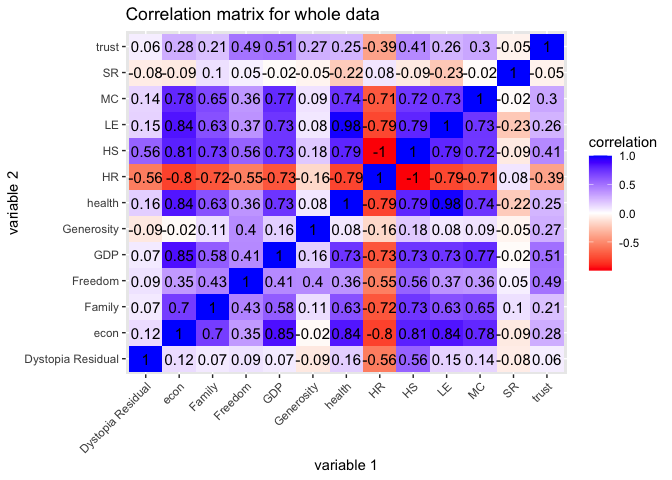<!-- -->

This correlation heatmap above shows that econ turns out to have strong
correlation with several variables, including Family, GDP, health, HS,
LE, and MC. GDP, too, has relatively strong correlation with other
variables, since basically GDP and econ have the same concept. HR and HS
have exactly -1 correlation because they are exactly the same thing but
country with higher score has low rank like No.1. LE and health also
have high correlation as they are the same thing. To my surprise, meat
consumption also turns out to have high correlation with other
variables. Suicide rate has really low correlation to all variables,
except LE and health. Generosity also has relatively low correlation.

``` r
# correlation heatmap for partial dataset
cor(data1_num, use = "pairwise.complete.obs") %>%
  # Save as a data frame
  as.data.frame %>%
  # Convert row names to an explicit variable
  rownames_to_column %>%
  # Pivot so that all correlations appear in the same column
  pivot_longer(-1, names_to = "other_var", values_to = "correlation") %>%
  ggplot(aes(rowname, other_var, fill=correlation)) +
  # Heatmap with geom_tile
  geom_tile() +
  # Change the scale to make the middle appear neutral
  scale_fill_gradient2(low="green",mid="white",high="purple") +
  # Overlay values
  geom_text(aes(label = round(correlation,2)), color = "black", size = 4) +
  # Give title and labels
  labs(title = "Correlation matrix for data1", x = "variable 1", y = "variable 2") 
```

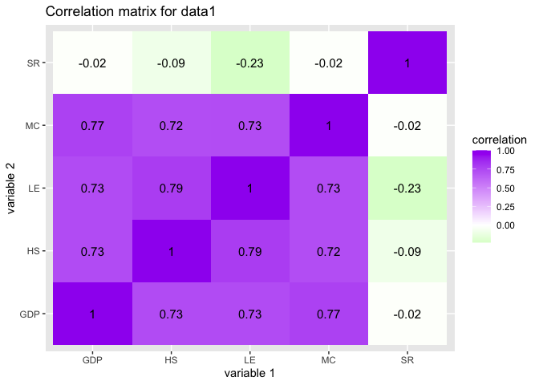<!-- -->

``` r
# We can add a new variable 'rank' to seperate the countries into four groups according to their happiness score using quantile

quantiles$HS
```

    ##      0%     25%     50%     75%    100% 
    ## 2.90500 4.38675 5.35150 6.28275 7.52600

``` r
new_data = new_data %>%
  mutate(rank = case_when(HS <= 4.38675 ~ 'low', 4.38675 < HS & HS <= 5.35150 ~ 'med_low',
                          5.35150 < HS & HS <= 6.28275 ~ 'med_high', HS > 6.28275 ~ 'high'))
```

``` r
# There are too many regions so we can simplify them into six main regions (basically combine those regions with 'Asia', 'Europe', 'Africa' each into one catagory, others remain the same)
sum_region = 
  new_data %>%
  mutate(Region2 = case_when(grepl("Asia", Region) ~ 'Asia',
         grepl("Europe", Region) ~ 'Europe', grepl("Africa", Region) ~ 'Africa',
         grepl("Latin", Region) ~ 'Latin America and Caribbean',
         grepl("America", Region) ~ 'North America',
         grepl("Australia", Region) ~ 'Australia and New Zealand'))

sum_region
```

    ## # A tibble: 140 x 17
    ##    Country Region    HR    HS  econ Family health Freedom  trust Generosity
    ##    <chr>   <chr>  <dbl> <dbl> <dbl>  <dbl>  <dbl>   <dbl>  <dbl>      <dbl>
    ##  1 Denmark Weste…     1  7.53  1.44  1.16   0.795   0.579 0.445       0.362
    ##  2 Iceland Weste…     3  7.50  1.43  1.18   0.867   0.566 0.150       0.477
    ##  3 Norway  Weste…     4  7.50  1.58  1.13   0.796   0.596 0.358       0.379
    ##  4 Finland Weste…     5  7.41  1.41  1.13   0.811   0.571 0.410       0.255
    ##  5 Canada  North…     6  7.40  1.44  1.10   0.828   0.574 0.313       0.448
    ##  6 Nether… Weste…     7  7.34  1.46  1.03   0.812   0.552 0.299       0.474
    ##  7 New Ze… Austr…     8  7.33  1.36  1.17   0.831   0.581 0.419       0.494
    ##  8 Austra… Austr…     9  7.31  1.44  1.10   0.851   0.568 0.323       0.474
    ##  9 Sweden  Weste…    10  7.29  1.45  1.09   0.831   0.582 0.409       0.383
    ## 10 Israel  Middl…    11  7.27  1.34  0.995  0.849   0.364 0.0873      0.323
    ## # … with 130 more rows, and 7 more variables: `Dystopia Residual` <dbl>,
    ## #   GDP <dbl>, LE <dbl>, MC <dbl>, SR <dbl>, rank <chr>, Region2 <chr>

``` r
# Make a ggplot that shows the relationship between GDP per capita and Meat consumption across regions
ggplot(sum_region, aes(GDP, MC))+
  geom_point(aes(color=Region2))+
  labs(title = "scatterplot of GDP and MC", x = "GDP per capita(dollar)", y = "meat consumption(kg)")
```

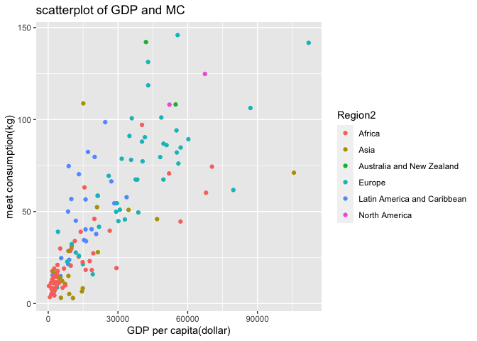<!-- -->

From the above scatterplot, we can see that Africa and Asia region tend
to have low meat consumption and low GDP. Europe, North America,
Austrlia and New Zealand seem to have high meat consumption and GDP per
capita. And there is a kind of linear relationship between the two
variables. The higher the GDP per capita, the more meat consumption the country has.

``` r
# Making a boxplot that shows the family extension performance according to happiness score rank
ggplot(sum_region, aes(x = rank, y = Family)) + 
  geom_boxplot() + 
  geom_jitter(alpha=.5, aes(color=Region2)) + 
  labs(title = "boxplot of Family according to rank")
```

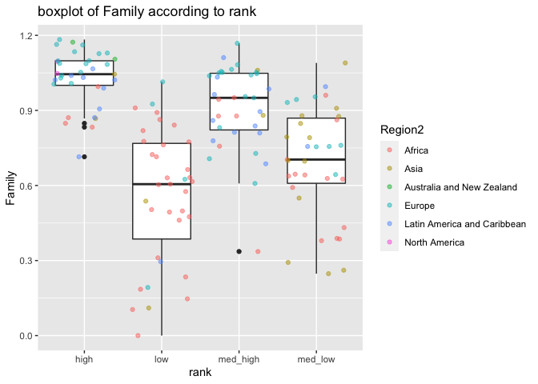<!-- -->

From the above plot, we find that low happiness score will have low
family score, as high happiness score will have high family score. There
are three outliers in the high rank and 1 in the med\_high. There is a
greater variability and range especially for low
rank.

``` r
# Create a barplot showing the mean meat consumption in each region based on different rank
ggplot(sum_region, aes(x = Region2, y = MC, fill=rank)) +
  geom_bar(position="dodge", stat = "summary", fun = "mean") + 
  theme(axis.text.x = element_text(angle = 15, hjust = 1)) + 
  labs(title = "barplot of mean MC across region based on HS", x = "Region", y = "mean meat consumption(kg)")
```

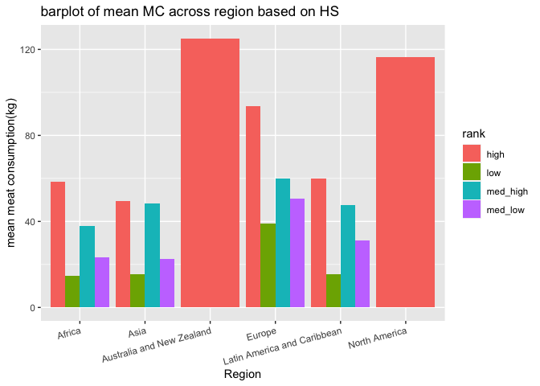<!-- -->

We observe that Australia, New Zealand, and North America regions only
have high happiness ranks and they have the highest meant consumption
across the world. Among all the countries, those with low rank tend to
have lower meat consumption. We can find that the higher the rank is,
the more meat consumption
    is.

### Perform k-means/PAM clustering or PCA

``` r
library(factoextra)
```

    ## Welcome! Want to learn more? See two factoextra-related books at https://goo.gl/ve3WBa

``` r
# Prepare data for PCA and run PCA
pca <- sum_region %>%
  # Remove categorical variables
  select_if(is.numeric) %>%   
  # Scale to 0 mean and unit variance (standardize)
  scale() %>%           
  prcomp()

# Results from PCA
names(pca)
```

    ## [1] "sdev"     "rotation" "center"   "scale"    "x"

``` r
# Visualize the results
pca
```

    ## Standard deviations (1, .., p=13):
    ##  [1] 2.6246683486 1.2273228501 1.1223549950 1.0540905418 0.8664674143
    ##  [6] 0.7117212121 0.6025508772 0.5359114546 0.4733180696 0.2813515614
    ## [11] 0.1336332122 0.0733416207 0.0002021966
    ## 
    ## Rotation (n x k) = (13 x 13):
    ##                           PC1          PC2         PC3          PC4
    ## HR                 0.35921310  0.026690499 -0.26553803  0.085270618
    ## HS                -0.36121443 -0.013179823  0.26154743 -0.076226294
    ## econ              -0.34360584 -0.173798988 -0.19737297 -0.013148401
    ## Family            -0.29399754 -0.007180972 -0.16797985 -0.255361551
    ## health            -0.34059329 -0.175334539 -0.12283813  0.169627377
    ## Freedom           -0.21485711  0.490425810  0.11437514 -0.067368926
    ## trust             -0.17174268  0.472365293  0.08099609  0.118404730
    ## Generosity        -0.06869743  0.608521056  0.03620385  0.225273806
    ## Dystopia Residual -0.11310138 -0.198721863  0.79830535 -0.161049302
    ## GDP               -0.32768926  0.055575109 -0.20557760  0.004117712
    ## LE                -0.34027030 -0.169724783 -0.12902241  0.183303800
    ## MC                -0.31944506 -0.074413441 -0.18046667 -0.068214549
    ## SR                 0.04008876  0.165066353 -0.17058320 -0.871348807
    ##                            PC5          PC6          PC7          PC8
    ## HR                 0.063905857  0.007642918 -0.051380556  0.082468256
    ## HS                -0.060378253  0.003807702  0.062505657 -0.071551752
    ## econ               0.072840967  0.027441008  0.008339761  0.004532661
    ## Family            -0.269807278 -0.300611730  0.693818224 -0.227479648
    ## health            -0.100642388 -0.010935405 -0.363037423 -0.267532458
    ## Freedom           -0.081804862 -0.650737061 -0.331084914  0.355982068
    ## trust              0.713607440  0.041091876  0.179331025 -0.285751767
    ## Generosity        -0.550149186  0.488423230  0.034272077 -0.087486507
    ## Dystopia Residual  0.013303151  0.186276549 -0.024199604  0.056854505
    ## GDP                0.274090755  0.316624833 -0.051163228  0.149124793
    ## LE                -0.097136915 -0.044698144 -0.352394592 -0.290932436
    ## MC                 0.025601052  0.256332508  0.128052436  0.709746351
    ## SR                 0.007375113  0.205737819 -0.305727898 -0.186694361
    ##                           PC9        PC10         PC11        PC12
    ## HR                -0.09635146  0.10132371 -0.106798122  0.86483105
    ## HS                 0.07025341 -0.11368048  0.069416880  0.28281289
    ## econ               0.48245990 -0.66594816 -0.021565458  0.21237256
    ## Family            -0.08742668  0.24055283 -0.036410449  0.13905405
    ## health            -0.28396844  0.12561304  0.672862887  0.14067784
    ## Freedom            0.09867833  0.05396662 -0.012447352  0.07719711
    ## trust             -0.27636936 -0.13504932 -0.006595658  0.03898874
    ## Generosity         0.03513023 -0.09176571 -0.020792852  0.05748601
    ## Dystopia Residual -0.02961471  0.12198987 -0.093791232  0.27549930
    ## GDP                0.50300663  0.62731110 -0.019214598  0.01072605
    ## LE                -0.24538236  0.07429565 -0.720209237 -0.02171908
    ## MC                -0.50462681 -0.11351784 -0.024352617 -0.02386212
    ## SR                -0.09288063 -0.05744958 -0.012207808  0.00394320
    ##                            PC13
    ## HR                 1.369348e-04
    ## HS                 8.244911e-01
    ## econ              -2.909113e-01
    ## Family            -1.939644e-01
    ## health            -1.637732e-01
    ## Freedom           -1.021927e-01
    ## trust             -7.665286e-02
    ## Generosity        -9.737493e-02
    ## Dystopia Residual -3.812351e-01
    ## GDP               -7.805587e-05
    ## LE                -1.118751e-04
    ## MC                -3.976153e-05
    ## SR                -9.775813e-06

``` r
# Visualize the rotated data
head(pca$x)
```

    ##            PC1       PC2       PC3          PC4          PC5        PC6
    ## [1,] -5.188401 1.6346098 0.4142592 -0.004563647  1.238316253  0.5169419
    ## [2,] -4.392658 0.9411363 0.4177129 -0.649786300 -1.277939446  0.6083534
    ## [3,] -4.769681 1.5885332 0.3385551  0.037088995  0.860966345  0.2481952
    ## [4,] -4.196241 1.1633051 0.8224724 -0.439760638  1.333233196 -0.3472544
    ## [5,] -4.564699 1.4951551 0.4119044  0.016783716 -0.005666074  0.5780627
    ## [6,] -4.367546 1.5170485 0.4631386  0.280252328 -0.019564461  0.7896089
    ##               PC7        PC8        PC9        PC10        PC11       PC12
    ## [1,]  0.774453507  0.7501469 -1.1467681 -0.35210192 -0.03355735 0.06378494
    ## [2,] -0.301552926 -0.1150154  0.2735804  0.25521920 -0.01356232 0.16280757
    ## [3,]  0.004698477 -0.5970551  0.9443087  0.44844066 -0.15533886 0.17636964
    ## [4,]  0.130330574 -0.8360186 -0.2497897 -0.09776508 -0.02576106 0.11958477
    ## [5,]  0.082804795  0.1714506 -0.4343271 -0.24834163 -0.06365822 0.10067773
    ## [6,] -0.065664352 -0.0692894  0.1337987 -0.05585306 -0.08172080 0.08477259
    ##               PC13
    ## [1,]  3.586710e-04
    ## [2,] -2.997174e-04
    ## [3,]  3.513973e-04
    ## [4,] -1.867876e-04
    ## [5,]  2.367917e-05
    ## [6,] -7.294305e-05

``` r
# Add the information about the different groups back into PCA data
pca_data <- data.frame(pca$x, Region = sum_region$Region2)

# Plot the data according to the new coordinate system: PC1 and PC2
ggplot(pca_data, aes(x = PC1, y = PC2, color = Region)) + 
  geom_point() + 
  labs(title = "scatterplot of PC2 vs PC1")
```

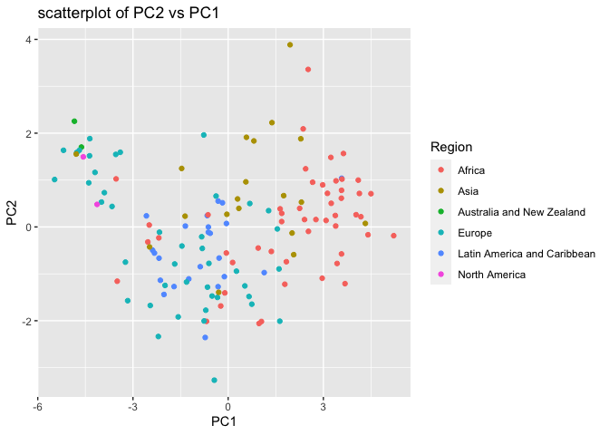<!-- -->

``` r
# Take a look at the rotation matrix
pca$rotation
```

    ##                           PC1          PC2         PC3          PC4
    ## HR                 0.35921310  0.026690499 -0.26553803  0.085270618
    ## HS                -0.36121443 -0.013179823  0.26154743 -0.076226294
    ## econ              -0.34360584 -0.173798988 -0.19737297 -0.013148401
    ## Family            -0.29399754 -0.007180972 -0.16797985 -0.255361551
    ## health            -0.34059329 -0.175334539 -0.12283813  0.169627377
    ## Freedom           -0.21485711  0.490425810  0.11437514 -0.067368926
    ## trust             -0.17174268  0.472365293  0.08099609  0.118404730
    ## Generosity        -0.06869743  0.608521056  0.03620385  0.225273806
    ## Dystopia Residual -0.11310138 -0.198721863  0.79830535 -0.161049302
    ## GDP               -0.32768926  0.055575109 -0.20557760  0.004117712
    ## LE                -0.34027030 -0.169724783 -0.12902241  0.183303800
    ## MC                -0.31944506 -0.074413441 -0.18046667 -0.068214549
    ## SR                 0.04008876  0.165066353 -0.17058320 -0.871348807
    ##                            PC5          PC6          PC7          PC8
    ## HR                 0.063905857  0.007642918 -0.051380556  0.082468256
    ## HS                -0.060378253  0.003807702  0.062505657 -0.071551752
    ## econ               0.072840967  0.027441008  0.008339761  0.004532661
    ## Family            -0.269807278 -0.300611730  0.693818224 -0.227479648
    ## health            -0.100642388 -0.010935405 -0.363037423 -0.267532458
    ## Freedom           -0.081804862 -0.650737061 -0.331084914  0.355982068
    ## trust              0.713607440  0.041091876  0.179331025 -0.285751767
    ## Generosity        -0.550149186  0.488423230  0.034272077 -0.087486507
    ## Dystopia Residual  0.013303151  0.186276549 -0.024199604  0.056854505
    ## GDP                0.274090755  0.316624833 -0.051163228  0.149124793
    ## LE                -0.097136915 -0.044698144 -0.352394592 -0.290932436
    ## MC                 0.025601052  0.256332508  0.128052436  0.709746351
    ## SR                 0.007375113  0.205737819 -0.305727898 -0.186694361
    ##                           PC9        PC10         PC11        PC12
    ## HR                -0.09635146  0.10132371 -0.106798122  0.86483105
    ## HS                 0.07025341 -0.11368048  0.069416880  0.28281289
    ## econ               0.48245990 -0.66594816 -0.021565458  0.21237256
    ## Family            -0.08742668  0.24055283 -0.036410449  0.13905405
    ## health            -0.28396844  0.12561304  0.672862887  0.14067784
    ## Freedom            0.09867833  0.05396662 -0.012447352  0.07719711
    ## trust             -0.27636936 -0.13504932 -0.006595658  0.03898874
    ## Generosity         0.03513023 -0.09176571 -0.020792852  0.05748601
    ## Dystopia Residual -0.02961471  0.12198987 -0.093791232  0.27549930
    ## GDP                0.50300663  0.62731110 -0.019214598  0.01072605
    ## LE                -0.24538236  0.07429565 -0.720209237 -0.02171908
    ## MC                -0.50462681 -0.11351784 -0.024352617 -0.02386212
    ## SR                -0.09288063 -0.05744958 -0.012207808  0.00394320
    ##                            PC13
    ## HR                 1.369348e-04
    ## HS                 8.244911e-01
    ## econ              -2.909113e-01
    ## Family            -1.939644e-01
    ## health            -1.637732e-01
    ## Freedom           -1.021927e-01
    ## trust             -7.665286e-02
    ## Generosity        -9.737493e-02
    ## Dystopia Residual -3.812351e-01
    ## GDP               -7.805587e-05
    ## LE                -1.118751e-04
    ## MC                -3.976153e-05
    ## SR                -9.775813e-06

``` r
# Save the rotation matrix in a data frame
rotation_data <- data.frame(
  pca$rotation, 
  variable = row.names(pca$rotation))

# Define an arrow style
arrow_style <- arrow(length = unit(0.05, "inches"), type = "closed")

# Plot the contribution of variables to PCs using geom_segment() for arrows and geom_text() for labels
ggplot(rotation_data) + 
  geom_segment(aes(xend = PC1, yend = PC2), x = 0, y = 0, arrow = arrow_style) + 
  geom_text(aes(x = PC1, y = PC2, label = variable), hjust = 0, size = 3, color = "red") + 
  xlim(-1., 1.25) + 
  ylim(-1., 1.) +
  coord_fixed() + 
  labs(title = "Contribution of variables to PC1 and PC2")
```

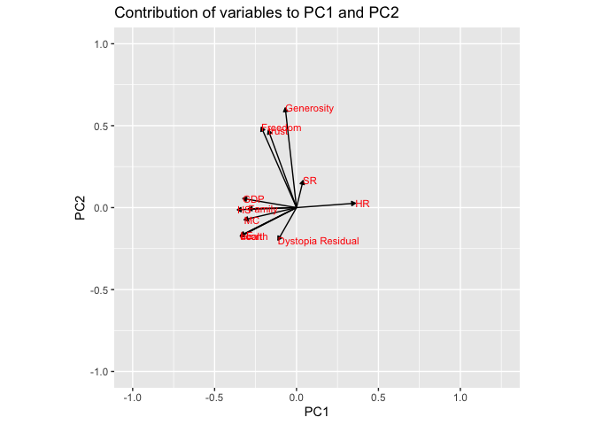<!-- -->

``` r
# Determine the percentage of variance explained by each component with sdev
percent <- 100* (pca$sdev^2 / sum(pca$sdev^2))
percent
```

    ##  [1] 5.299141e+01 1.158709e+01 9.689852e+00 8.546976e+00 5.775121e+00
    ##  [6] 3.896516e+00 2.792827e+00 2.209239e+00 1.723308e+00 6.089131e-01
    ## [11] 1.373680e-01 4.137687e-02 3.144883e-07

``` r
# Visualize the percentage of variance explained by each component
perc_data <- data.frame(percent = percent, PC = 1:length(percent))
ggplot(perc_data, aes(x = PC, y = percent)) + 
  geom_col() + 
  geom_text(aes(label = round(percent, 2)), size = 4, vjust = -0.5) + 
  ylim(0, 80) + 
  labs(title = 'percentage of variance explained by each component')
```

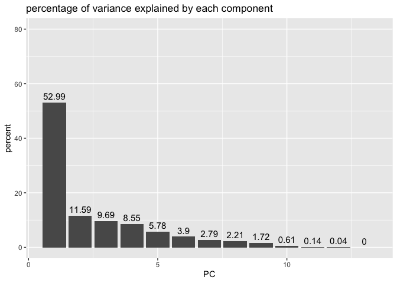<!-- -->

From the contribution graph, we can see that GDP, HS, HR, Family, MC,
Health, Econ contribute mostly to PC1, Generosity, SR, Freedpm, trust
contribute more to PC2.

``` r
52.99 + 11.59 + 9.69 + 8.55
```

    ## [1] 82.82

From the percent graph, we should consider the first four PCs since we
should pick PCs until cumulative proportion of variances is greater than
80%.

``` r
# Visualize the eigenvalues and variances of the PCS in a table
get_eig(pca)
```

    ##          eigenvalue variance.percent cumulative.variance.percent
    ## Dim.1  6.888884e+00     5.299141e+01                    52.99141
    ## Dim.2  1.506321e+00     1.158709e+01                    64.57850
    ## Dim.3  1.259681e+00     9.689852e+00                    74.26835
    ## Dim.4  1.111107e+00     8.546976e+00                    82.81533
    ## Dim.5  7.507658e-01     5.775121e+00                    88.59045
    ## Dim.6  5.065471e-01     3.896516e+00                    92.48697
    ## Dim.7  3.630676e-01     2.792827e+00                    95.27979
    ## Dim.8  2.872011e-01     2.209239e+00                    97.48903
    ## Dim.9  2.240300e-01     1.723308e+00                    99.21234
    ## Dim.10 7.915870e-02     6.089131e-01                    99.82125
    ## Dim.11 1.785784e-02     1.373680e-01                    99.95862
    ## Dim.12 5.378993e-03     4.137687e-02                   100.00000
    ## Dim.13 4.088348e-08     3.144883e-07                   100.00000

``` r
# Visualize percentage of variances for each PC in a scree plot
fviz_eig(pca, addlabels = TRUE, ylim = c(0, 70))
```

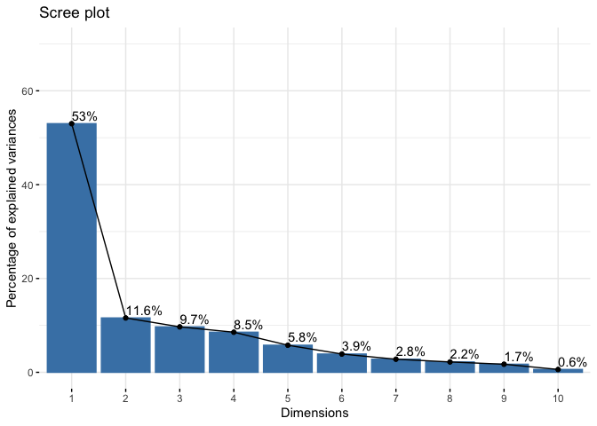<!-- -->

We can also choose PCs by Kaiser’s rule, only the first four PCs have
eigenvalues greater than 1, so we should consider PC1, PC2, PC3, and
PC4.

And using the factoextra package, we can also get the percent graph, and
see that PC1 explains 53% of the variance, PC2 explains 11.6% of the
variance, ect.

``` r
# Visualize the contributions of the variables to the PCs in a table
get_pca_var(pca)$contrib
```

    ##                        Dim.1        Dim.2      Dim.3        Dim.4        Dim.5
    ## HR                12.9034051  0.071238272  7.0510446  0.727107828  0.408395856
    ## HS                13.0475867  0.017370773  6.8407059  0.581044792  0.364553349
    ## econ              11.8064976  3.020608826  3.8956091  0.017288046  0.530580644
    ## Family             8.6434551  0.005156635  2.8217229  6.520952186  7.279596749
    ## health            11.6003786  3.074220072  1.5089207  2.877344708  1.012889032
    ## Freedom            4.6163580 24.051747470  1.3081672  0.453857216  0.669203543
    ## trust              2.9495549 22.312896961  0.6560367  1.401968014 50.923557892
    ## Generosity         0.4719336 37.029787519  0.1310719  5.074828771 30.266412688
    ## Dystopia Residual  1.2791923  3.949037893 63.7291432  2.593687751  0.017697383
    ## GDP               10.7380251  0.308859270  4.2262151  0.001695556  7.512574214
    ## LE                11.5783874  2.880650196  1.6646782  3.360028296  0.943558033
    ## MC                10.2045147  0.553736020  3.2568218  0.465322468  0.065541387
    ## SR                 0.1607109  2.724690094  2.9098627 75.924874368  0.005439229
    ##                         Dim.6        Dim.7        Dim.8       Dim.9     Dim.10
    ## HR                 0.00584142  0.263996151  0.680101326  0.92836037  1.0266494
    ## HS                 0.00144986  0.390695710  0.511965320  0.49355410  1.2923252
    ## econ               0.07530089  0.006955162  0.002054502 23.27675512 44.3486950
    ## Family             9.03674124 48.138372796  5.174699044  0.76434248  5.7865665
    ## health             0.01195831 13.179617030  7.157361627  8.06380777  1.5778635
    ## Freedom           42.34587223 10.961722046 12.672323294  0.97374134  0.2912396
    ## trust              0.16885423  3.215961638  8.165407215  7.63800207  1.8238318
    ## Generosity        23.85572516  0.117457527  0.765388883  0.12341330  0.8420945
    ## Dystopia Residual  3.46989527  0.058562086  0.323243470  0.08770313  1.4881528
    ## GDP               10.02512851  0.261767589  2.223820402 25.30156667 39.3519221
    ## LE                 0.19979240 12.418194849  8.464168220  6.02125046  0.5519843
    ## MC                 6.57063549  1.639742626 50.373988262 25.46482204  1.2886300
    ## SR                 4.23280500  9.346954791  3.485478434  0.86268114  0.3300454
    ##                         Dim.11       Dim.12       Dim.13
    ## HR                 1.140583894 74.793273939 1.875115e-06
    ## HS                 0.481870322  7.998313109 6.797856e+01
    ## econ               0.046506897  4.510210624 8.462938e+00
    ## Family             0.132572077  1.933602919 3.762219e+00
    ## health            45.274446473  1.979025435 2.682167e+00
    ## Freedom            0.015493657  0.595939336 1.044335e+00
    ## trust              0.004350271  0.152012205 5.875660e-01
    ## Generosity         0.043234268  0.330464171 9.481877e-01
    ## Dystopia Residual  0.879679523  7.589986670 1.453402e+01
    ## GDP                0.036920077  0.011504811 6.092719e-07
    ## LE                51.870134491  0.047171840 1.251603e-06
    ## MC                 0.059304994  0.056940057 1.580979e-07
    ## SR                 0.014903057  0.001554882 9.556653e-09

``` r
# Visualize the 5 top contributions of the variables to the PCs in a bar graph
  # Note the red dash line indicates the average contribution
fviz_contrib(pca, choice = "var", axes = 1, top = 5) # on PC1
```

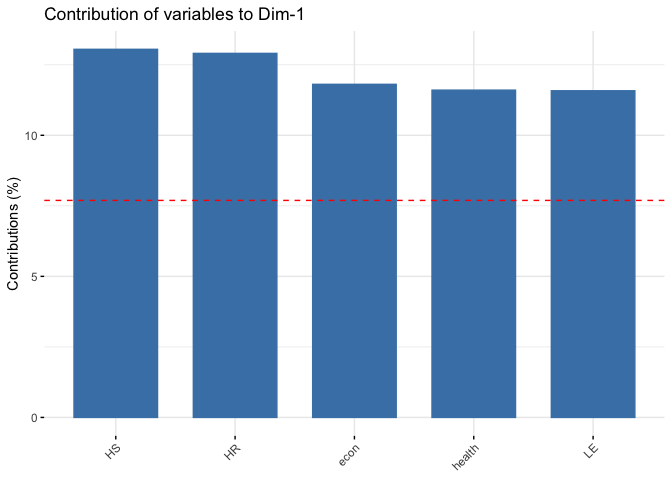<!-- -->

``` r
fviz_contrib(pca, choice = "var", axes = 2, top = 5) # on PC2
```

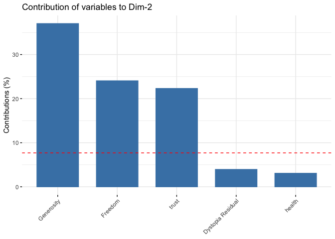<!-- -->

``` r
# Visualize the contributions of the variables to the PCs in a correlation circle
fviz_pca_var(pca, col.var = "black", 
             repel = TRUE) # Avoid text overlapping
```

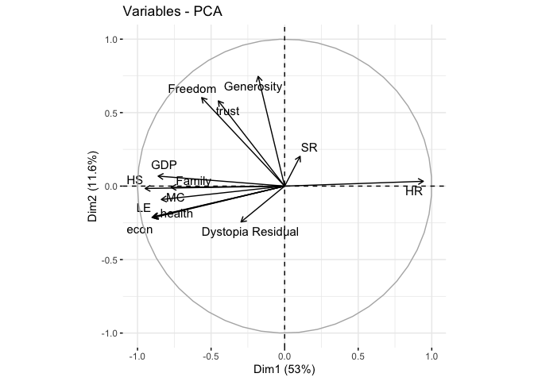<!-- -->

We can also visualize the 5 top contributions of the variables to the
PCs in a bar graph. HS, HR, econ, health, and LE contribute to PC1 the
most. And Generosity, Freedom, and trust contribute to PC2 the most.

``` r
# Visualize both variables and individuals in the same graph
fviz_pca_biplot(pca)
```

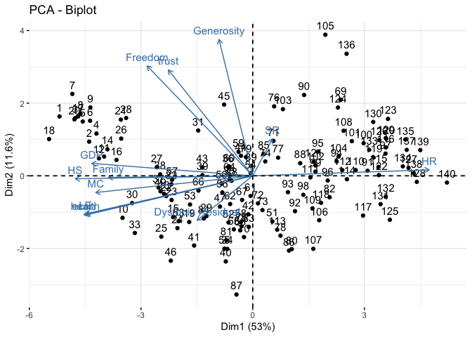<!-- -->

This graph also shows the contribution, but it has observations
displayed and in which direction each observation goes, which makes it
more clearer.

``` r
# Visualize the individuals according to PC1 and PC2
fviz_pca_ind(pca,
             geom.ind = "point", # show points only (nbut not "text")
             col.ind = sum_region$Region2, # color by groups
             palette = c("#00AFBB", "#E7B800", "#FC4E07", "#BB3099", "#445965","#d0fa0a"),
             addEllipses = TRUE, # Concentration ellipses
             legend.title = "outcome"
             )
```

    ## Too few points to calculate an ellipse
    ## Too few points to calculate an ellipse

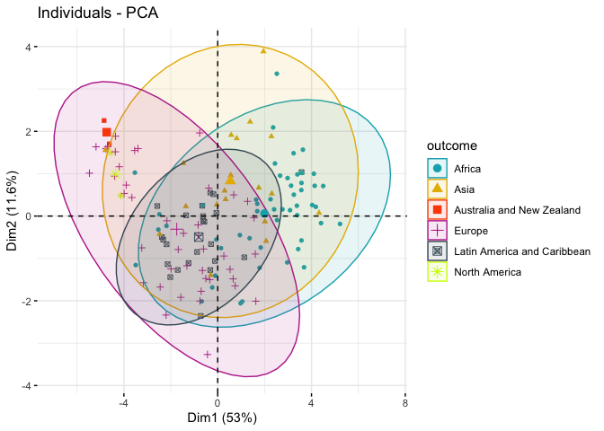<!-- -->

### Reference:

Network, S. (2019, November 27). World happiness report. Retrieved March
20, 2021, from
<https://www.kaggle.com/unsdsn/world-happiness?select=2016.csv>

Daniboy370. (2020, September 19). WORLD data by country (2020).
Retrieved March 20, 2021, from
<https://www.kaggle.com/daniboy370/world-data-by-country-2020>
